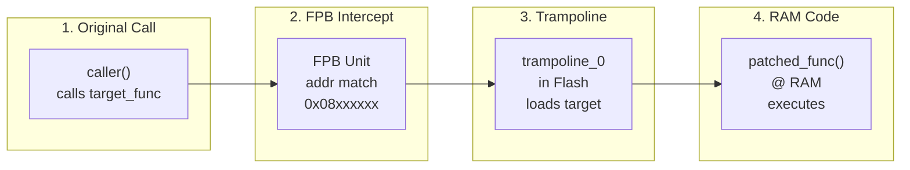
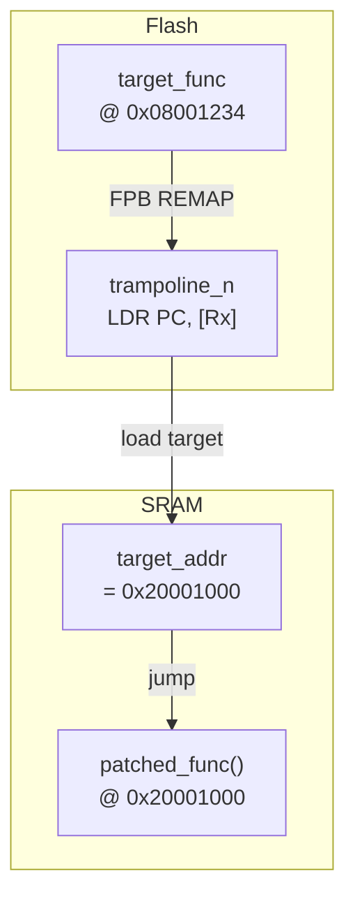
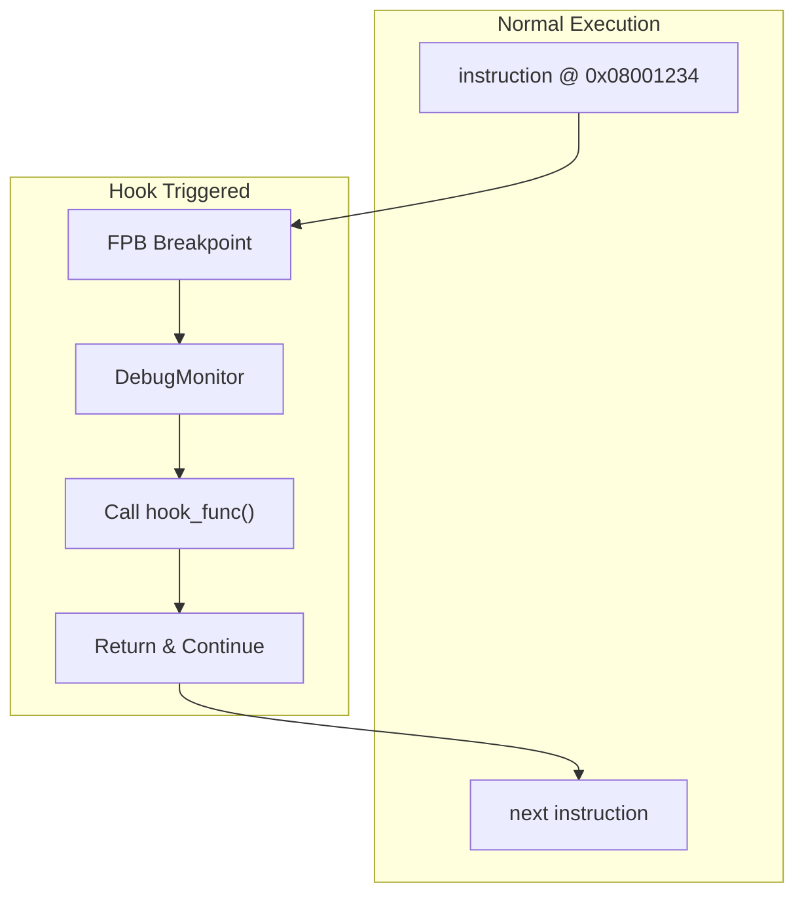

# FPBInject Architecture

Technical documentation for the FPB-based code injection system.

## Overview

FPBInject enables runtime function hooking on ARM Cortex-M microcontrollers using the Flash Patch and Breakpoint (FPB) hardware unit. It redirects function calls to custom code in RAM without modifying Flash memory.

## Injection Flow



## FPB Unit

### What is FPB?

The Flash Patch and Breakpoint unit is a Cortex-M debug component designed for:
1. Setting hardware breakpoints
2. Patching Flash bugs without reprogramming

FPBInject repurposes FPB's REMAP feature for code injection.

### FPB Versions

| Version | Architecture | REMAP | Breakpoint |
|---------|--------------|-------|------------|
| FPBv1 | Cortex-M3/M4 (ARMv7-M) | ✅ | ✅ |
| FPBv2 | Cortex-M23/M33/M55 (ARMv8-M) | ❌ | ✅ |

> **Note**: ARMv8-M removed REMAP, requiring DebugMonitor mode.

### STM32F103 FPB Resources

| Resource | Count | Range |
|----------|-------|----- -|
| Code Comparators | 6-8 (FPB v1: 6, v2: 8) | 0x00000000 - 0x1FFFFFFF |
| Literal Comparators | 2 | 0x00000000 - 0x1FFFFFFF |
| REMAP Table | 8 entries | SRAM |

### FPB Registers

| Register | Address | Description |
|----------|---------|-------------|
| FP_CTRL | 0xE0002000 | Control register |
| FP_REMAP | 0xE0002004 | Remap table base |
| FP_COMP0-7 | 0xE0002008-24 | Code/Literal comparators |

## Patch Modes

### 1. Trampoline Mode (Default)

Best for: Cortex-M3/M4



**How it works:**
1. FPB redirects original function to pre-placed trampoline in Flash
2. Trampoline reads target address from RAM table
3. Trampoline jumps to injection code in RAM

### 2. DebugMonitor Mode

Best for: ARMv8-M or when trampolines unavailable


**How it works:**
1. FPB generates breakpoint (not REMAP)
2. DebugMonitor exception triggers
3. Handler modifies stacked PC to redirect execution
4. Exception return continues at inject function

**Exception Stack Frame:**

| Offset | Register | Description |
|--------|----------|-------------|
| SP+0 | R0 | preserved |
| SP+4 | R1 | preserved |
| SP+8 | R2 | preserved |
| SP+12 | R3 | preserved |
| SP+16 | R12 | preserved |
| SP+20 | LR | preserved |
| SP+24 | PC | ← MODIFIED to patched_func |
| SP+28 | xPSR | preserved |

### 3. Hook Mode (Non-replacing)

Best for: Instrumentation without changing execution flow



**How it works:**
1. FPB breakpoint triggers at specified address
2. DebugMonitor calls hook function (void -> void)
3. Execution continues at next instruction
4. Original code flow unchanged

### 3. Direct Mode

For special cases with direct RAM REMAP support.

## Memory Allocation

### Static Mode (Default)

Fixed 4KB buffer in RAM with proper alignment:

```c
__attribute__((aligned(8), section(".ram_code")))
static uint8_t inject_buffer[4096];
```

### Dynamic Mode (LIBC/UMM)

Uses `malloc()` with 8-byte alignment handling:


## Compilation Process

### 1. Extract Compiler Flags

Parse `compile_commands.json` to get:
- Include paths (`-I`)
- Defines (`-D`)
- Warning flags

### 2. Compile Injection Code

```bash
arm-none-eabi-gcc -c patch.c -o patch.o \
    -mcpu=cortex-m3 -mthumb -Os \
    -ffunction-sections -fdata-sections \
    -fPIC -msingle-pic-base \
    -mno-pic-data-is-text-relative
```

Key flags:
- `-fPIC -msingle-pic-base`: Position-independent code
- `-mno-pic-data-is-text-relative`: Proper data addressing

### 3. Link at Target Address

```bash
arm-none-eabi-ld patch.o -o patch.elf \
    -Ttext=0x20001000 \
    --gc-sections
```

### 4. Extract Binary

```bash
arm-none-eabi-objcopy -O binary patch.elf patch.bin
```

## Protocol

### Serial Commands

| Command | Description |
|---------|-------------|
| `info` | Query FPB status |
| `alloc <size>` | Allocate RAM |
| `upload <addr> <data>` | Upload binary data |
| `patch <comp> <orig> <target>` | Set FPB patch |
| `unpatch <comp>` | Clear patch |
| `ping` | Connection test |

### Response Format

```
OK <data>
ERROR <message>
```

## API Reference

### FPB Functions

```c
void fpb_init(void);
void fpb_set_patch(uint8_t comp, uint32_t orig, uint32_t target);
void fpb_clear_patch(uint8_t comp);
fpb_state_t fpb_get_state(void);
```

### Trampoline Functions

```c
void fbp_trampoline_set_target(uint32_t comp, uint32_t target);
void fbp_trampoline_clear_target(uint32_t comp);
uint32_t fbp_trampoline_get_address(uint32_t comp);
```

### DebugMonitor Functions

```c
void fpb_debugmon_init(void);
void fpb_debugmon_set_redirect(uint8_t comp, uint32_t orig, uint32_t target);
void fpb_debugmon_clear_redirect(uint8_t comp);
```

## Limitations

1. **Address Range**: Code region only (0x00000000 - 0x1FFFFFFF)
2. **Hook Count**: 6-8 simultaneous patches (FPB v1: 6, FPB v2: 8)
3. **Instruction Set**: Thumb/Thumb-2 only
4. **Debugger Conflict**: Debuggers may use FPB for breakpoints

## NuttX Integration

On NuttX, DebugMonitor uses native `up_debugpoint_add()` API:

```c
up_debugpoint_add(DEBUGPOINT_BREAKPOINT, addr, size, callback, &info);
```

Replace vendor's PANIC handler with NuttX's handler:

```c
irq_attach(NVIC_IRQ_DBGMONITOR, arm_dbgmonitor, NULL);
```

## References

- [ARM Cortex-M3 TRM](https://developer.arm.com/documentation/ddi0337)
- [ARM Debug Interface Spec](https://developer.arm.com/documentation/ihi0031)
- [STM32F103 Reference Manual](https://www.st.com/resource/en/reference_manual/rm0008.pdf)
