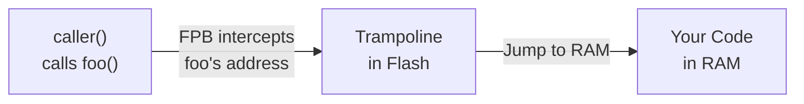

# FPBInject

[](https://opensource.org/licenses/MIT)
[](https://www.st.com/en/microcontrollers-microprocessors/stm32f103.html)
[](https://github.com/apache/nuttx)
[](https://deepwiki.com/FASTSHIFT/FPBInject)
[](https://github.com/FASTSHIFT/FPBInject/actions/workflows/ci.yml)

Runtime code injection for ARM Cortex-M. Replace any function on a running MCU through a serial connection — no reflashing, no debugger, no downtime.

FPBInject uses the Flash Patch and Breakpoint (FPB) hardware unit to intercept function calls and redirect them to your custom code in RAM, while the original Flash stays untouched.


## How It Works



The FPB unit matches the target function's address, redirects execution through a trampoline in Flash, which jumps to your replacement function in RAM. All handled by hardware — zero software overhead on the call path.

## Workbench

FPBInject ships with a browser-based workbench for the full workflow: browse symbols, read disassembly, write patches, and inject — all from one interface.

### Symbol Search & Disassembly

Search the firmware's symbol table, click a function to view its disassembly or decompiled source.


### Write & Inject

Write your replacement function in C, hit inject. The workbench compiles, uploads, and patches — typically under a second.


## Quick Start

### 1. Build & Flash Firmware

```bash
git clone https://github.com/FASTSHIFT/FPBInject.git
cd FPBInject

cmake -B build -DAPP_SELECT=3 -DCMAKE_TOOLCHAIN_FILE=cmake/arm-none-eabi-gcc.cmake
cmake --build build

st-flash write build/FPBInject.bin 0x08000000
```

### 2. Start the Workbench

```bash
cd Tools/WebServer
pip install -r ../requirements.txt
python main.py
```

Open `http://127.0.0.1:5500` in your browser, connect to the serial port, load your ELF file, and start patching.

### 3. Or Use the CLI

All commands output JSON, designed for scripting and AI agent integration.

```bash
# Search for functions
python fpb_cli.py search firmware.elf "gpio"

# View disassembly
python fpb_cli.py disasm firmware.elf digitalWrite

# Inject a patch
python fpb_cli.py --port /dev/ttyACM0 --elf firmware.elf \
    --compile-commands build/compile_commands.json \
    inject digitalWrite patch.c
```

See the [CLI Guide](Docs/CLI.md) for the full command reference.

## Writing Patches

Create a C file with the `/* FPB_INJECT */` marker. The function signature must match the original.

```c
#include <Arduino.h>

/* FPB_INJECT */
__attribute__((section(".fpb.text"), used))
void digitalWrite(uint8_t pin, uint8_t value) {
    Serial.printf("Patched: pin=%d val=%d\n", pin, value);
    value ? GPIO_SetBits(GPIOA, 1 << pin)
          : GPIO_ResetBits(GPIOA, 1 << pin);
}
```

> Calling the original function from injected code is not supported — the FPB redirect applies to all callers, so it would cause infinite recursion.

## Supported Hardware

| Feature | Spec |
|---------|------|
| Architecture | ARMv7-M, ARMv8-M |
| Tested MCU | STM32F103C8T6 |
| Patch Slots | 6 (FPB v1) or 8 (FPB v2) |
| Patch Modes | Trampoline / Direct (ARMv7-M REMAP), DebugMonitor (ARMv8-M BKPT) |
| RTOS Support | Bare-metal, NuttX |
| Connection | Serial (USB-to-UART or USB CDC) |


<details>
<summary>CMake Build Options</summary>

| Option | Default | Description |
|--------|---------|-------------|
| `APP_SELECT` | 1 | Application selection (3 = func_loader) |
| `FL_ALLOC_MODE` | STATIC | Memory allocation: STATIC or LIBC |
| `FPB_NO_DEBUGMON` | OFF | Disable DebugMonitor mode |

</details>

<details>
<summary>Project Structure</summary>

```
FPBInject/
├── Source/                 # FPB driver, trampoline, DebugMonitor
├── App/
│   ├── func_loader/        # Serial protocol, memory allocator, FPB control
│   ├── inject/             # Injection helpers
│   └── tests/              # Firmware unit tests (host-based, with coverage)
├── Project/                # Platform HAL (STM32F10x, Arduino API)
├── Tools/
│   └── WebServer/          # Workbench (Flask backend + JS frontend) & CLI
└── Docs/                   # Architecture, CLI reference, WebServer guide
```

</details>

## Documentation

| Document | Description |
|----------|-------------|
| [Architecture](Docs/Architecture.md) | FPB internals, patch modes, memory layout, protocol |
| [CLI Reference](Docs/CLI.md) | All CLI commands with examples and JSON output format |
| [WebServer Guide](Docs/WebServer.md) | Workbench setup and usage |

## License

[MIT](LICENSE)

## References

- [ARM Cortex-M3 Technical Reference Manual](https://developer.arm.com/documentation/ddi0337)
- [ARMv7-M Architecture Reference Manual](https://developer.arm.com/documentation/ddi0403)
- [STM32F103 Reference Manual](https://www.st.com/resource/en/reference_manual/rm0008.pdf)
