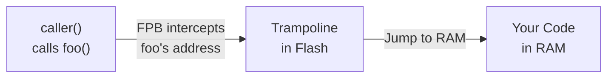

# FPBInject

**English** | [中文](README_zh.md)

[](https://opensource.org/licenses/MIT)
[](https://pypi.org/project/fpbinject/)
[](https://github.com/FASTSHIFT/FPBInject/releases)
[](https://www.st.com/en/microcontrollers-microprocessors/stm32f103.html)
[](https://github.com/apache/nuttx)
[](https://deepwiki.com/FASTSHIFT/FPBInject)
[](https://github.com/FASTSHIFT/FPBInject/actions/workflows/ci.yml)

Runtime code injection for ARM Cortex-M. Replace any function on a running MCU through a serial connection — no reflashing, no debugger, no downtime.

FPBInject uses the [Flash Patch and Breakpoint (FPB)](https://developer.arm.com/documentation/ddi0337/h/debug/about-the-flash-patch-and-breakpoint-unit--fpb-) hardware unit to intercept function calls and redirect them to your custom code in RAM, while the original Flash stays untouched.


## Traditional vs FPBInject


```mermaid
gantt
    title Iteration cycle comparison (typical STM32 project)
    dateFormat  s
    axisFormat  %Ss

    section Traditional
    Edit code          : a1, 0, 5s
    Compile & link     : a2, after a1, 15s
    Erase flash        : a3, after a2, 3s
    Flash write        : a4, after a3, 5s
    MCU reboot         : a5, after a4, 2s
    Reproduce issue    : a6, after a5, 5s

    section FPBInject
    Edit code          : b1, 0, 5s
    Compile & inject   : b2, after b1, 1s
    Reproduce issue    : b3, after b2, 5s
```

The traditional cycle touches flash on every iteration — compile, erase, write, reboot, then finally reproduce the issue. With FPBInject, the MCU never stops: save your patch, it's live in under a second. No pit stop required.

## How It Works


```mermaid
flowchart LR
    A["caller()<br/>calls foo()"] -->|"FPB intercepts<br/>foo's address"| B["Trampoline<br/>in Flash"]
    B -->|"Jump to RAM"| C["Your Code<br/>in RAM"]
```

The FPB unit matches the target function's address, redirects execution through a trampoline in Flash, which jumps to your replacement function in RAM. All handled by hardware — zero software overhead on the call path.

## Workbench

FPBInject ships with a browser-based workbench for the full workflow: browse symbols, read disassembly, write patches, and inject — all from one interface.

### Symbol Search & Disassembly

Search the firmware's symbol table, click a function to view its disassembly or decompiled source.


### Manual Inject

Write your replacement function in C, then hit inject. The workbench compiles, uploads, and patches — typically under a second.


### Auto Inject

Point the workbench at your source directory and enable file watching. Add `/* FPB_INJECT */` before any function you want to patch, then just save the file — the workbench detects the change, recompiles, and re-injects automatically.


## File Transfer (Optional)

FPBInject also supports file transfer over serial — browse, upload, and download files on the device's filesystem. Supports drag-and-drop (files and folders), CRC verification, and progress tracking.

Filesystem backends: POSIX (NuttX VFS, Linux), FatFS, standard C library (stdio), or custom implementations via the `fl_fs_ops_t` interface.


## Memory Access

Read and write arbitrary memory addresses on the device over the same serial connection — handy for inspecting or poking a variable's live value without a debugger attached.

```bash
fpbinject --port /dev/ttyACM0 mem-read 0x20000000 64
fpbinject --port /dev/ttyACM0 mem-write 0x20000000 DEADBEEF
```

## Unpatch

Every patch can be removed at any time, instantly restoring the original Flash behavior — the safety net that makes live patching low-risk to experiment with.

```bash
fpbinject --port /dev/ttyACM0 unpatch --comp 0   # or --all
```

## Remote Control & Auto-Discovery

The workbench advertises itself over mDNS, so the CLI and SDK can find it on the LAN without knowing its IP:

```bash
fpbinject discover                       # list visible WebServers
fpbinject -s bench-pc:5500 info          # control one by host:port
```

This also means one workbench can be shared by multiple engineers, or one script can drive several devices across the network — each identified by its own handle.

## Virtual Serial Passthrough

The workbench can expose a PTY device file (e.g. `/tmp/fpb-ttyACM0`) that mirrors the full byte stream to/from the device, so external tools (minicom, pyserial, a legacy logging script) can attach without disconnecting the workbench.

```bash
fpbinject vserial-start     # start
fpbinject vserial-status    # check the symlink path
fpbinject vserial-stop      # stop
```

## Quick Start

### 1. Build & Flash Firmware

```bash
git clone https://github.com/FASTSHIFT/FPBInject.git
cd FPBInject

cmake -B build -DAPP_SELECT=3 -DCMAKE_TOOLCHAIN_FILE=cmake/arm-none-eabi-gcc.cmake
cmake --build build

st-flash write build/FPBInject.bin 0x08000000
```

### 2. Install the Host Tools

Install from PyPI — this provides the `fpbinject-server` (workbench) and
`fpbinject` (CLI) commands, plus the Python SDK:

```bash
pip install fpbinject
```

<details>
<summary>Or run from source (no install)</summary>

```bash
cd Tools/WebServer
pip install -r ../requirements.txt
python main.py           # workbench
python fpb_cli.py --help # CLI
```

</details>

### 3. Start the Workbench

```bash
fpbinject-server
```

Open `http://127.0.0.1:5500` in your browser, connect to the serial port, load your ELF file, and start patching.

### 4. Or Use the CLI

All commands output JSON, designed for scripting and AI agent integration.

```bash
# Search for functions
fpbinject search firmware.elf "gpio"

# View disassembly
fpbinject disasm firmware.elf digitalWrite

# Inject a patch
fpbinject --port /dev/ttyACM0 --elf firmware.elf \
    --compile-commands build/compile_commands.json \
    inject digitalWrite patch.c
```

See the [CLI Guide](Docs/CLI.md) for the full command reference.

### 5. Or Use the Python SDK

Drive everything the CLI can do from Python:

```python
from fpbinject import Client

# Auto-discover a running WebServer on the LAN (mDNS)
client = Client.discover(token="...")
client.serial_send("help\r\n")
print(client.serial_read()["raw_data"])
client.inject("digitalWrite", "patch.c", elf="firmware.elf")

# Or skip the WebServer entirely — talk to the serial port directly
with Client.direct("/dev/ttyACM0") as dev:
    dev.inject("digitalWrite", "patch.c", elf="firmware.elf")

# Or analyze an ELF offline — no device needed
off = Client.offline()
print(off.signature("firmware.elf", "digitalWrite"))
```

See the [SDK Guide](Docs/SDK.md) for the full API.

## Writing Patches

Create a C file with the `/* FPB_INJECT */` marker. The function signature must match the original.

```c
#include <Arduino.h>

/* FPB_INJECT */
__attribute__((section(".fpb.text"), used))
void digitalWrite(uint8_t pin, uint8_t value) {
    printf("Patched: pin=%d val=%d\n", pin, value);
    value ? digitalWrite_HIGH(pin)
          : digitalWrite_LOW(pin);
}
```

> To call the original function from injected code, you need two things: a function pointer pointing directly at the original address (bypassing the FPB redirect), and temporarily disabling the patch around the call. Direct calls by name will still be intercepted by FPB and cause infinite recursion.
>
> ```c
> /* Define a function pointer to the original address (| 1 sets the Thumb bit) */
> typedef void (*digitalWrite_fn_t)(uint8_t, uint8_t);
> static digitalWrite_fn_t const ORIG_DIGITALWRITE = (digitalWrite_fn_t)(0x08001234 | 1);
>
> /* FPB_INJECT */
> __attribute__((section(".fpb.text"), used))
> void digitalWrite(uint8_t pin, uint8_t value) {
>     printf("Patched: pin=%d val=%d\n", pin, value);
>
>     /* Disable patch -> call original via pointer -> re-enable */
>     fpb_enable_patch(0, false);
>     ORIG_DIGITALWRITE(pin, value);
>     fpb_enable_patch(0, true);
> }
> ```
>
> The workbench generates this pattern automatically when the original function address is known.

## Supported Hardware

| Feature | Spec |
|---------|------|
| Architecture | ARMv7-M, ARMv8-M |
| Tested MCU | STM32F103C8T6 |
| Patch Slots | 6 (FPB v1) or 8 (FPB v2) |
| Patch Modes | Trampoline / Direct (ARMv7-M REMAP), DebugMonitor (ARMv8-M BKPT) |
| RTOS Support | Bare-metal, NuttX |
| Connection | Serial (USB-to-UART or USB CDC) |


<details>
<summary>CMake Build Options</summary>

| Option | Default | Description |
|--------|---------|-------------|
| `APP_SELECT` | 1 | Application selection (3 = func_loader) |
| `FL_ALLOC_MODE` | STATIC | Memory allocation: STATIC or LIBC |
| `FPB_NO_DEBUGMON` | OFF | Disable DebugMonitor mode |

</details>

<details>
<summary>Project Structure</summary>

```
FPBInject/
├── Source/                 # FPB driver, trampoline, DebugMonitor
├── App/
│   ├── func_loader/        # Serial protocol, memory allocator, FPB control
│   ├── inject/             # Injection helpers
│   └── tests/              # Firmware unit tests (host-based, with coverage)
├── Project/                # Platform HAL (STM32F10x, Arduino API)
├── Tools/
│   └── WebServer/          # Workbench (Flask backend + JS frontend) & CLI
└── Docs/                   # Architecture, CLI reference, WebServer guide
```

</details>

## Development

### Git Hooks (recommended)

Install the local git hooks once per clone to catch formatting/lint issues
before they reach CI, and to keep Gerrit `Change-Id:` trailers out of commits
(this public mirror's CI rejects them):

```bash
Tools/hooks/install.sh
```

This points `core.hooksPath` at the tracked `Tools/hooks/` directory, which:

- **`pre-commit`** — runs the fast subset of CI on *staged files only*:
  C/C++ `clang-format`, `shfmt`, `cmake-format`, Kconfig lint, Python
  `black` + `flake8`, and `prettier` for JS/HTML/CSS. Any check whose tool is
  not installed is skipped with a notice (never blocks).
- **`commit-msg`** — strips any stray `Change-Id:` trailer.

Heavy checks (multi-config builds, unit tests, coverage) stay in CI only.

```bash
git commit --no-verify         # bypass hooks for one commit
Tools/hooks/install.sh --uninstall
```

### Coding Standards

- **No Chinese in code** (identifiers, comments, logs). Docs may be Chinese;
  user-facing UI strings live in `Tools/WebServer/static/js/locales/*.js`
  (never hard-code them). The test suite enforces this.
- **Commit messages** follow `type(scope): summary` (e.g. `fix(transfer): ...`).
  Do not include Gerrit `Change-Id:` trailers.
- **Formatting is enforced.** Run the formatters before committing:
  - Firmware / C / CMake / shell: `Tools/code_format.sh`
  - WebServer (Python/JS/HTML/CSS): `Tools/WebServer/format.sh --lint`
- **Tests must pass with coverage.** Backend target is 85%, firmware 80%:
  - WebServer: `python Tools/WebServer/tests/run_tests.py --coverage --target 85`
  - Firmware: `cd App/tests && ./run_tests.sh coverage --threshold 80`
- **Version bumps** go through `Tools/update_version.py X.Y.Z[aN]` (single
  source of truth for firmware header, Python, and JS).

## Documentation

| Document | Description |
|----------|-------------|
| [Architecture](Docs/Architecture.md) | FPB internals, patch modes, memory layout, protocol |
| [CLI Reference](Docs/CLI.md) | All CLI commands with examples and JSON output format |
| [SDK Guide](Docs/SDK.md) | `pip install fpbinject` — Python `Client` API reference |
| [WebServer Guide](Docs/WebServer.md) | Workbench setup and usage |

## License

[MIT](LICENSE)

## References

- [ARM Cortex-M3 Technical Reference Manual](https://developer.arm.com/documentation/ddi0337)
- [ARMv7-M Architecture Reference Manual](https://developer.arm.com/documentation/ddi0403)
- [STM32F103 Reference Manual](https://www.st.com/resource/en/reference_manual/rm0008.pdf)
