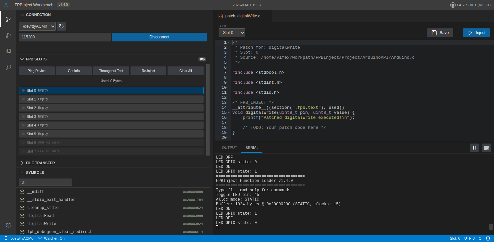
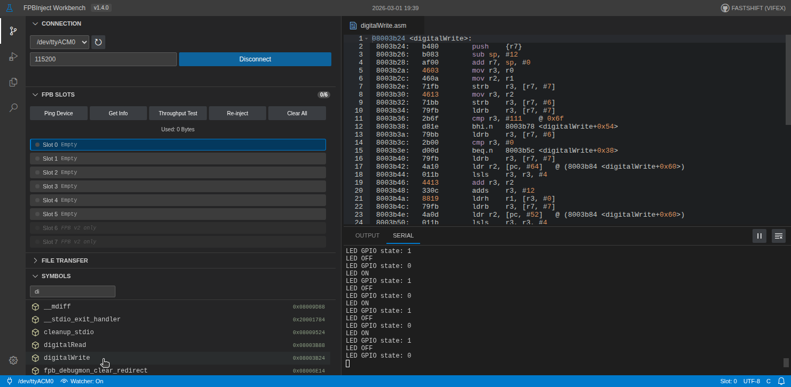
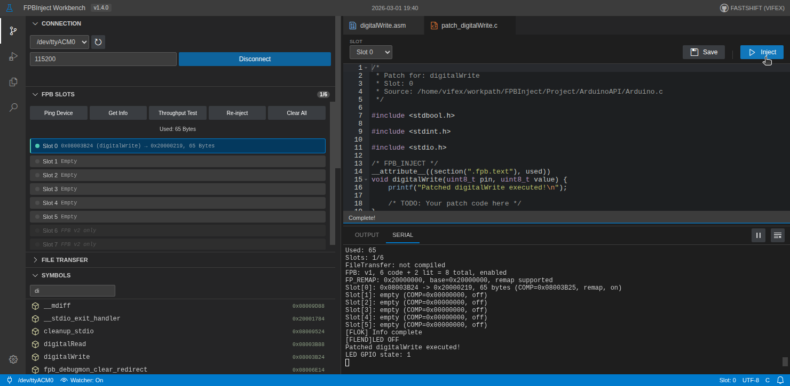
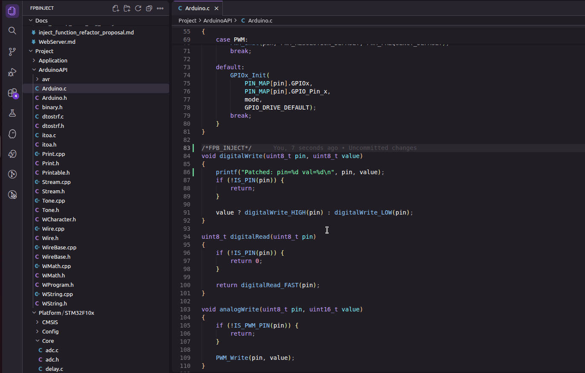
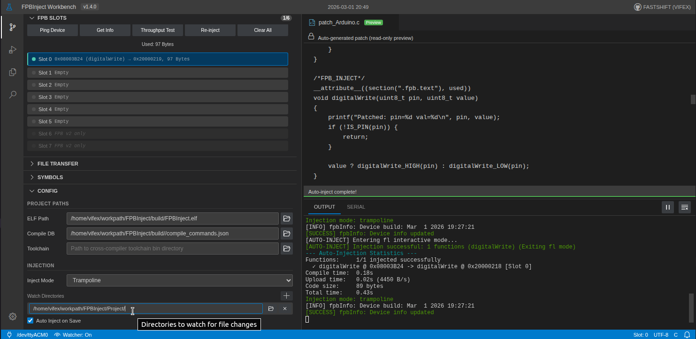

# FPBInject

[English](README.md) | **中文**

[](https://opensource.org/licenses/MIT)
[](https://www.st.com/en/microcontrollers-microprocessors/stm32f103.html)
[](https://github.com/apache/nuttx)
[](https://deepwiki.com/FASTSHIFT/FPBInject)
[](https://github.com/FASTSHIFT/FPBInject/actions/workflows/ci.yml)

ARM Cortex-M 运行时代码注入工具。通过串口连接，在不重新烧录、不需要调试器的情况下，替换正在运行的 MCU 上的任意函数。

FPBInject 利用 [Flash Patch and Breakpoint（FPB）](https://developer.arm.com/documentation/ddi0337/h/debug/about-the-flash-patch-and-breakpoint-unit--fpb-)硬件单元拦截函数调用，将执行重定向到 RAM 中的自定义代码，原始 Flash 内容保持不变。



## 工作原理


FPB 单元匹配目标函数地址，通过 Flash 中的跳板代码将执行重定向到 RAM 中的替换函数。全程由硬件完成，调用路径零软件开销。

## 工作台

FPBInject 自带浏览器工作台，支持完整工作流：浏览符号、查看反汇编、编写补丁、一键注入。

### 符号搜索与反汇编

搜索固件符号表，点击函数查看反汇编或反编译源码。



### 手动注入

用 C 语言编写替换函数，点击注入。工作台自动编译、上传、打补丁，通常不到一秒完成。



### 自动注入

在工作台中指定源码目录并开启文件监控。在需要替换的函数前添加 `/* FPB_INJECT */` 标记，保存文件即可 — 工作台自动检测变更、重新编译并注入。





## 快速开始

### 1. 编译与烧录固件

```bash
git clone https://github.com/FASTSHIFT/FPBInject.git
cd FPBInject

cmake -B build -DAPP_SELECT=3 -DCMAKE_TOOLCHAIN_FILE=cmake/arm-none-eabi-gcc.cmake
cmake --build build

st-flash write build/FPBInject.bin 0x08000000
```

### 2. 启动工作台

```bash
cd Tools/WebServer
pip install -r ../requirements.txt
python main.py
```

浏览器打开 `http://127.0.0.1:5500`，连接串口，加载 ELF 文件，即可开始注入。

### 3. 或使用 CLI

所有命令输出 JSON，适合脚本和 AI 代理集成。

```bash
# 搜索函数
python fpb_cli.py search firmware.elf "gpio"

# 查看反汇编
python fpb_cli.py disasm firmware.elf digitalWrite

# 注入补丁
python fpb_cli.py --port /dev/ttyACM0 --elf firmware.elf \
    --compile-commands build/compile_commands.json \
    inject digitalWrite patch.c
```

完整命令参考见 [CLI 文档](Docs/CLI.md)。

## 编写补丁

创建带 `/* FPB_INJECT */` 标记的 C 文件，函数签名必须与原始函数一致。

```c
#include <Arduino.h>

/* FPB_INJECT */
__attribute__((section(".fpb.text"), used))
void digitalWrite(uint8_t pin, uint8_t value) {
    printf("Patched: pin=%d val=%d\n", pin, value);
    value ? digitalWrite_HIGH(pin)
          : digitalWrite_LOW(pin);
}
```

> 不支持在注入代码中调用原始函数 — FPB 重定向对所有调用者生效，会导致无限递归。

## 支持的硬件

| 特性 | 规格 |
|------|------|
| 架构 | ARMv7-M, ARMv8-M |
| 已测试 MCU | STM32F103C8T6 |
| 补丁槽位 | 6 个（FPB v1）或 8 个（FPB v2） |
| 补丁模式 | Trampoline / Direct（ARMv7-M REMAP）、DebugMonitor（ARMv8-M BKPT） |
| RTOS 支持 | 裸机、NuttX |
| 连接方式 | 串口（USB 转 UART 或 USB CDC） |


<details>
<summary>CMake 构建选项</summary>

| 选项 | 默认值 | 说明 |
|------|--------|------|
| `APP_SELECT` | 1 | 应用选择（3 = func_loader） |
| `FL_ALLOC_MODE` | STATIC | 内存分配方式：STATIC 或 LIBC |
| `FPB_NO_DEBUGMON` | OFF | 禁用 DebugMonitor 模式 |

</details>

<details>
<summary>项目结构</summary>

```
FPBInject/
├── Source/                 # FPB 驱动、跳板代码、DebugMonitor
├── App/
│   ├── func_loader/        # 串口协议、内存分配器、FPB 控制
│   ├── inject/             # 注入辅助代码
│   └── tests/              # 固件单元测试（宿主机运行，支持覆盖率）
├── Project/                # 平台 HAL（STM32F10x、Arduino API）
├── Tools/
│   └── WebServer/          # 工作台（Flask 后端 + JS 前端）& CLI
└── Docs/                   # 架构文档、CLI 参考、WebServer 指南
```

</details>

## 文档

| 文档 | 说明 |
|------|------|
| [架构](Docs/Architecture.md) | FPB 内部原理、补丁模式、内存布局、协议 |
| [CLI 参考](Docs/CLI.md) | 所有 CLI 命令及示例、JSON 输出格式 |
| [WebServer 指南](Docs/WebServer.md) | 工作台安装与使用 |

## 许可证

[MIT](LICENSE)

## 参考资料

- [ARM Cortex-M3 技术参考手册](https://developer.arm.com/documentation/ddi0337)
- [ARMv7-M 架构参考手册](https://developer.arm.com/documentation/ddi0403)
- [STM32F103 参考手册](https://www.st.com/resource/en/reference_manual/rm0008.pdf)
