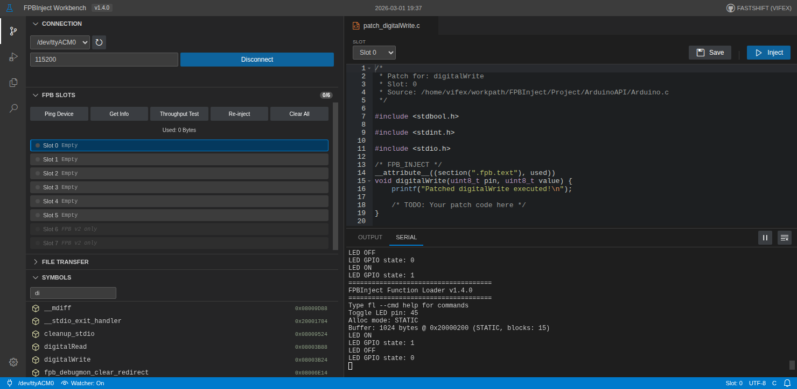
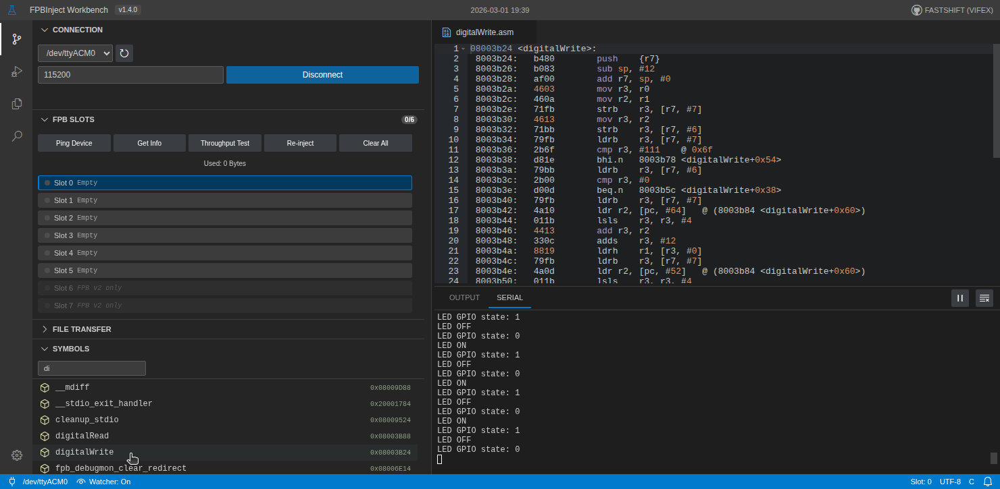
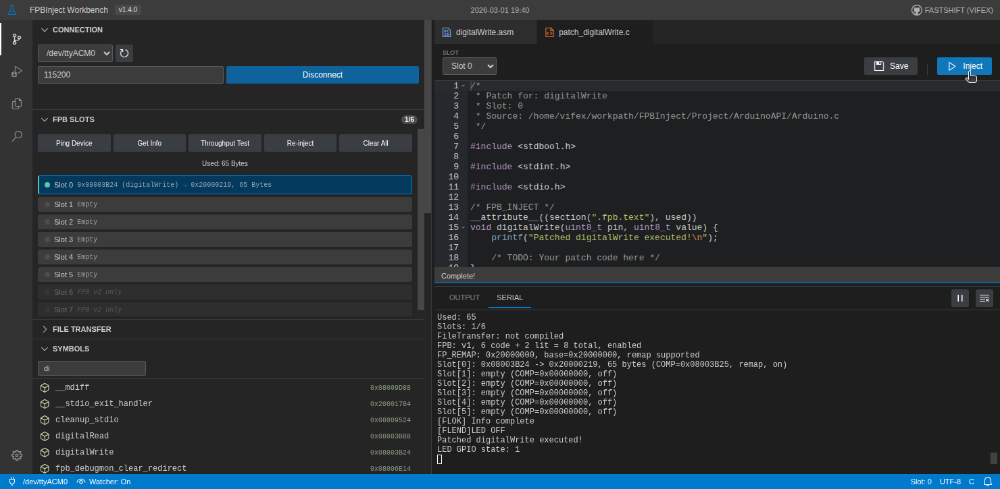
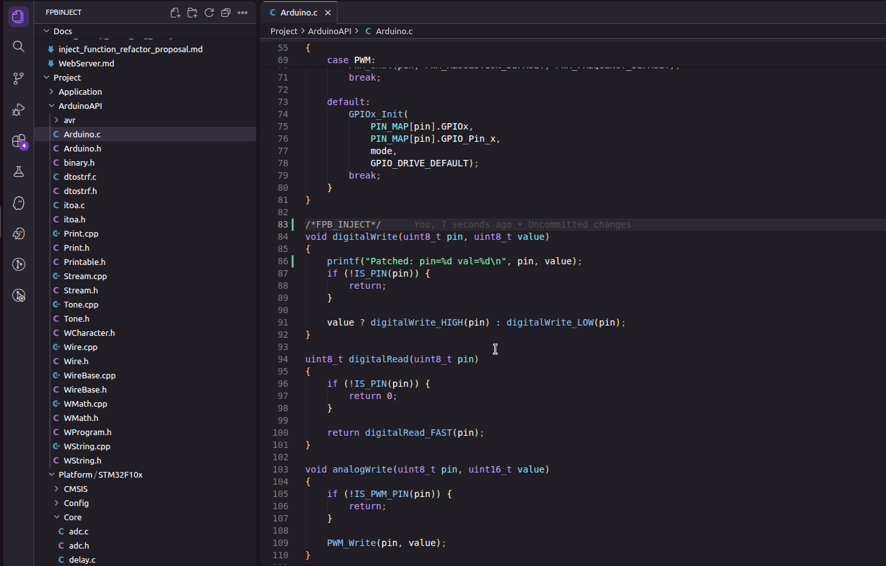
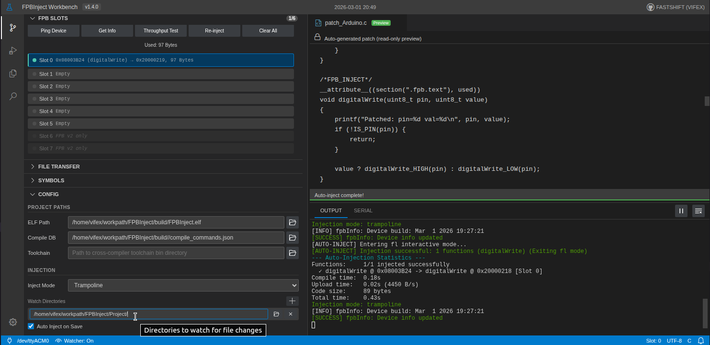
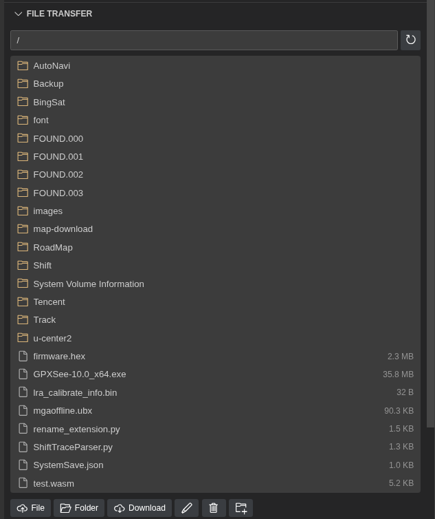

# FPBInject

[English](README.md) | **中文**

[](https://opensource.org/licenses/MIT)
[](https://pypi.org/project/fpbinject/)
[](https://github.com/FASTSHIFT/FPBInject/releases)
[](https://www.st.com/en/microcontrollers-microprocessors/stm32f103.html)
[](https://github.com/apache/nuttx)
[](https://deepwiki.com/FASTSHIFT/FPBInject)
[](https://github.com/FASTSHIFT/FPBInject/actions/workflows/ci.yml)

ARM Cortex-M 运行时代码注入工具。通过串口连接，在不重新烧录、不需要调试器的情况下，替换正在运行的 MCU 上的任意函数。

FPBInject 利用 [Flash Patch and Breakpoint（FPB）](https://developer.arm.com/documentation/ddi0337/h/debug/about-the-flash-patch-and-breakpoint-unit--fpb-)硬件单元拦截函数调用，将执行重定向到 RAM 中的自定义代码，原始 Flash 内容保持不变。



## 传统方式 vs FPBInject


```mermaid
gantt
    title 迭代周期对比（典型 STM32 项目）
    dateFormat  s
    axisFormat  %Ss

    section 传统方式
    修改代码           : a1, 0, 5s
    编译链接           : a2, after a1, 15s
    擦除 Flash         : a3, after a2, 3s
    烧录写入           : a4, after a3, 5s
    MCU 重启           : a5, after a4, 2s
    复现问题           : a6, after a5, 5s

    section FPBInject
    修改代码           : b1, 0, 5s
    编译注入           : b2, after b1, 1s
    复现问题           : b3, after b2, 5s
```

传统方式每次迭代都要经历编译、擦除、烧录、重启，才能复现问题。FPBInject 让 MCU 全程不停机：保存补丁，不到一秒即可生效，真正实现“**不熄火修车**”。

## 工作原理


```mermaid
flowchart LR
    A["caller()<br/>调用 foo()"] -->|"FPB 拦截<br/>foo 的地址"| B["跳板代码<br/>Flash 中"]
    B -->|"跳转到 RAM"| C["你的代码<br/>RAM 中"]
```

FPB 单元匹配目标函数地址，通过 Flash 中的跳板代码将执行重定向到 RAM 中的替换函数。全程由硬件完成，调用路径零软件开销。

## 工作台

FPBInject 自带浏览器工作台，支持完整工作流：浏览符号、查看反汇编、编写补丁、一键注入。

### 符号搜索与反汇编

搜索固件符号表，点击函数查看反汇编或反编译源码。



### 手动注入

用 C 语言编写替换函数，点击注入。工作台自动编译、上传、打补丁，通常不到一秒完成。



### 自动注入

在工作台中指定源码目录并开启文件监控。在需要替换的函数前添加 `/* FPB_INJECT */` 标记，保存文件即可 — 工作台自动检测变更、重新编译并注入。





## 文件传输（可选）

FPBInject 还支持通过串口进行文件传输 — 浏览、上传、下载设备文件系统中的文件。支持拖拽上传（文件和文件夹）、CRC 校验和传输进度显示。

文件系统后端：POSIX（NuttX VFS、Linux）、FatFS、标准 C 库（stdio），或通过 `fl_fs_ops_t` 接口自定义实现。



## 内存读写

通过同一条串口连接，直接读写设备上任意内存地址——无需接调试器即可查看或修改变量的实时值。

```bash
fpbinject --port /dev/ttyACM0 mem-read 0x20000000 64
fpbinject --port /dev/ttyACM0 mem-write 0x20000000 DEADBEEF
```

## 撤销补丁

任何补丁都可以随时移除，立即恢复原始 Flash 行为——这是让热补丁能放心大胆尝试的安全网。

```bash
fpbinject --port /dev/ttyACM0 unpatch --comp 0   # 或 --all 移除全部
```

## 远程控制与自动发现

工作台通过 mDNS 广播自己，CLI 和 SDK 无需知道 IP 就能在局域网内找到它：

```bash
fpbinject discover                       # 列出局域网内可见的 WebServer
fpbinject -s bench-pc:5500 info          # 通过 host:port 控制指定设备
```

这也意味着一个工作台可以让多个工程师共用，或者一个脚本可以同时驱动网络上的多台设备——每台都用各自的 handle 区分。

## 虚拟串口透传

工作台可以暴露一个 PTY 设备文件（例如 `/tmp/fpb-ttyACM0`），将设备的全部收发字节镜像出来，让外部工具（minicom、pyserial，或既有的日志脚本）可以接入，而不必断开工作台。

```bash
fpbinject vserial-start     # 启动
fpbinject vserial-status    # 查看符号链接路径
fpbinject vserial-stop      # 停止
```

## 快速开始

### 1. 编译与烧录固件

```bash
git clone https://github.com/FASTSHIFT/FPBInject.git
cd FPBInject

cmake -B build -DAPP_SELECT=3 -DCMAKE_TOOLCHAIN_FILE=cmake/arm-none-eabi-gcc.cmake
cmake --build build

st-flash write build/FPBInject.bin 0x08000000
```

### 2. 安装主机工具

从 PyPI 安装——提供 `fpbinject-server`（工作台）和 `fpbinject`（CLI）两个命令，以及 Python SDK：

```bash
pip install fpbinject
```

<details>
<summary>或从源码运行（无需安装）</summary>

```bash
cd Tools/WebServer
pip install -r ../requirements.txt
python main.py            # 工作台
python fpb_cli.py --help  # CLI
```

</details>

### 3. 启动工作台

```bash
fpbinject-server
```

浏览器打开 `http://127.0.0.1:5500`，连接串口，加载 ELF 文件，即可开始注入。

### 4. 或使用 CLI

所有命令输出 JSON，适合脚本和 AI 代理集成。

```bash
# 搜索函数
fpbinject search firmware.elf "gpio"

# 查看反汇编
fpbinject disasm firmware.elf digitalWrite

# 注入补丁
fpbinject --port /dev/ttyACM0 --elf firmware.elf \
    --compile-commands build/compile_commands.json \
    inject digitalWrite patch.c
```

完整命令参考见 [CLI 文档](Docs/CLI.md)。

### 5. 或使用 Python SDK

用 Python 调用 CLI 的全部能力：

```python
from fpbinject import Client

# mDNS 自动发现局域网内的 WebServer
client = Client.discover(token="...")
client.serial_send("help\r\n")
print(client.serial_read()["raw_data"])
client.inject("digitalWrite", "patch.c", elf="firmware.elf")

# 或完全不用 WebServer——直接操作串口
with Client.direct("/dev/ttyACM0") as dev:
    dev.inject("digitalWrite", "patch.c", elf="firmware.elf")

# 或离线分析 ELF——无需设备
off = Client.offline()
print(off.signature("firmware.elf", "digitalWrite"))
```

完整 API 见 [SDK 文档](Docs/SDK.md)。

## 编写补丁

创建带 `/* FPB_INJECT */` 标记的 C 文件，函数签名必须与原始函数一致。

```c
#include <Arduino.h>

/* FPB_INJECT */
__attribute__((section(".fpb.text"), used))
void digitalWrite(uint8_t pin, uint8_t value) {
    printf("Patched: pin=%d val=%d\n", pin, value);
    value ? digitalWrite_HIGH(pin)
          : digitalWrite_LOW(pin);
}
```

> 如需在注入代码中调用原始函数，需要两步配合：用函数指针直接指向原始地址（绕过 FPB 重定向），同时在调用前后用 `fpb_enable_patch` 临时禁用补丁。直接按函数名调用仍会被 FPB 拦截，导致无限递归。
>
> ```c
> /* 定义指向原始地址的函数指针（| 1 设置 Thumb bit） */
> typedef void (*digitalWrite_fn_t)(uint8_t, uint8_t);
> static digitalWrite_fn_t const ORIG_DIGITALWRITE = (digitalWrite_fn_t)(0x08001234 | 1);
>
> /* FPB_INJECT */
> __attribute__((section(".fpb.text"), used))
> void digitalWrite(uint8_t pin, uint8_t value) {
>     printf("Patched: pin=%d val=%d\n", pin, value);
>
>     /* 禁用补丁 -> 通过指针调用原始函数 -> 恢复补丁 */
>     fpb_enable_patch(0, false);
>     ORIG_DIGITALWRITE(pin, value);
>     fpb_enable_patch(0, true);
> }
> ```
>
> 工作台在已知原始函数地址时会自动生成上述模板。

## 支持的硬件

| 特性 | 规格 |
|------|------|
| 架构 | ARMv7-M, ARMv8-M |
| 已测试 MCU | STM32F103C8T6 |
| 补丁槽位 | 6 个（FPB v1）或 8 个（FPB v2） |
| 补丁模式 | Trampoline / Direct（ARMv7-M REMAP）、DebugMonitor（ARMv8-M BKPT） |
| RTOS 支持 | 裸机、NuttX |
| 连接方式 | 串口（USB 转 UART 或 USB CDC） |


<details>
<summary>CMake 构建选项</summary>

| 选项 | 默认值 | 说明 |
|------|--------|------|
| `APP_SELECT` | 1 | 应用选择（3 = func_loader） |
| `FL_ALLOC_MODE` | STATIC | 内存分配方式：STATIC 或 LIBC |
| `FPB_NO_DEBUGMON` | OFF | 禁用 DebugMonitor 模式 |

</details>

<details>
<summary>项目结构</summary>

```
FPBInject/
├── Source/                 # FPB 驱动、跳板代码、DebugMonitor
├── App/
│   ├── func_loader/        # 串口协议、内存分配器、FPB 控制
│   ├── inject/             # 注入辅助代码
│   └── tests/              # 固件单元测试（宿主机运行，支持覆盖率）
├── Project/                # 平台 HAL（STM32F10x、Arduino API）
├── Tools/
│   └── WebServer/          # 工作台（Flask 后端 + JS 前端）& CLI
└── Docs/                   # 架构文档、CLI 参考、WebServer 指南
```

</details>

## 开发规范

### Git 钩子（推荐）

每个 clone 执行一次，安装本地 git 钩子：在问题进入 CI 之前就地拦截格式/lint
错误，并阻止 Gerrit `Change-Id:` 尾注混入提交（本公开镜像的 CI 会拒绝它们）：

```bash
Tools/hooks/install.sh
```

它会把 `core.hooksPath` 指向仓库内跟踪的 `Tools/hooks/` 目录：

- **`pre-commit`** —— 只对**已暂存文件**跑 CI 的快速子集：
  C/C++ `clang-format`、`shfmt`、`cmake-format`、Kconfig lint、Python
  `black` + `flake8`，以及 JS/HTML/CSS 的 `prettier`。缺失对应工具的检查会
  提示并跳过，绝不阻断。
- **`commit-msg`** —— 清除任何残留的 `Change-Id:` 尾注。

重量级检查（多配置编译、单元测试、覆盖率）仍只在 CI 运行。

```bash
git commit --no-verify         # 单次提交跳过钩子
Tools/hooks/install.sh --uninstall
```

### 编码规范

- **代码零中文**（标识符、注释、日志）。文档可用中文；面向用户的 UI 文案放在
  `Tools/WebServer/static/js/locales/*.js`（禁止硬编码）。测试会强制校验。
- **提交信息**遵循 `type(scope): summary`（如 `fix(transfer): ...`），
  不要带 Gerrit `Change-Id:` 尾注。
- **格式强制统一**，提交前先跑格式化：
  - 固件 / C / CMake / shell：`Tools/code_format.sh`
  - WebServer（Python/JS/HTML/CSS）：`Tools/WebServer/format.sh --lint`
- **测试须通过且达覆盖率**，后端 85%、固件 80%：
  - WebServer：`python Tools/WebServer/tests/run_tests.py --coverage --target 85`
  - 固件：`cd App/tests && ./run_tests.sh coverage --threshold 80`
- **版本号变更**统一走 `Tools/update_version.py X.Y.Z[aN]`（固件头、Python、
  JS 的唯一来源）。

## 文档

| 文档 | 说明 |
|------|------|
| [架构](Docs/Architecture.md) | FPB 内部原理、补丁模式、内存布局、协议 |
| [CLI 参考](Docs/CLI.md) | 所有 CLI 命令及示例、JSON 输出格式 |
| [SDK 指南](Docs/SDK.md) | `pip install fpbinject` — Python `Client` API 参考 |
| [WebServer 指南](Docs/WebServer.md) | 工作台安装与使用 |

## 许可证

[MIT](LICENSE)

## 参考资料

- [ARM Cortex-M3 技术参考手册](https://developer.arm.com/documentation/ddi0337)
- [ARMv7-M 架构参考手册](https://developer.arm.com/documentation/ddi0403)
- [STM32F103 参考手册](https://www.st.com/resource/en/reference_manual/rm0008.pdf)
