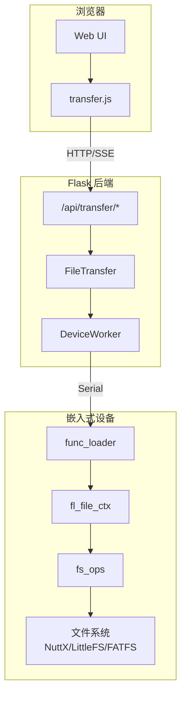
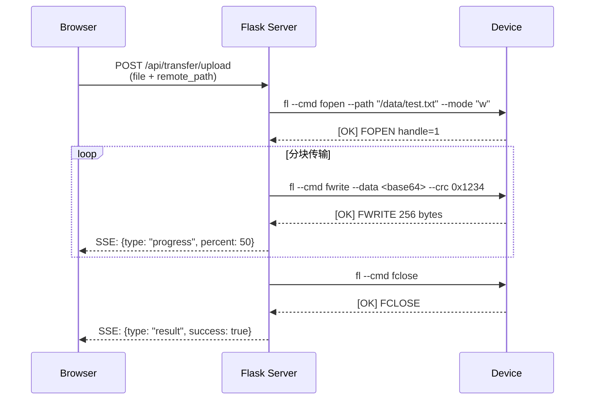
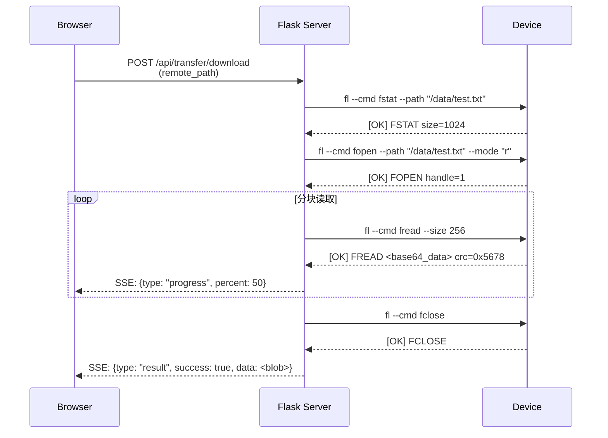
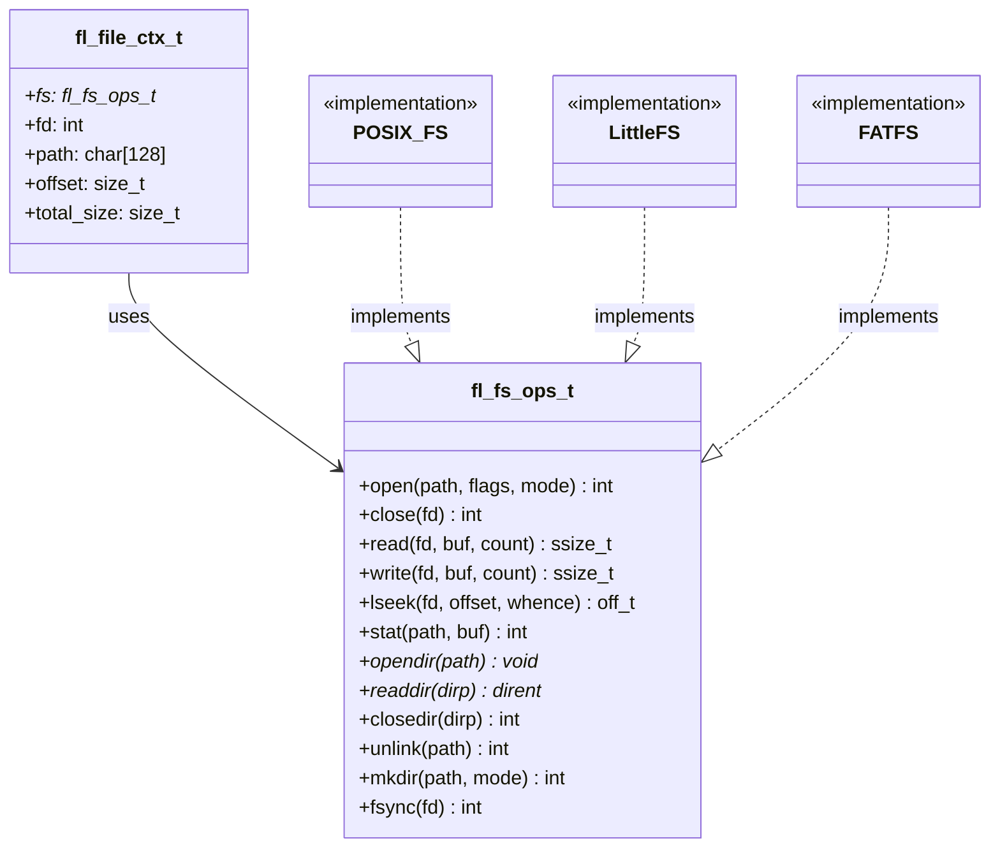

# FPBInject 文件传输功能设计方案

## 实现状态

✅ **Phase 1: 设备侧基础实现** - 已完成
- `func_loader_file.h` - 文件系统抽象接口
- `func_loader_file.c` - 文件传输实现（POSIX 默认）
- 命令: fopen, fwrite, fread, fclose, fstat, flist, fremove, fmkdir

✅ **Phase 2: 后端 API 实现** - 已完成
- `core/file_transfer.py` - 文件传输核心类
- `app/routes/transfer.py` - REST API 端点
- SSE 进度推送

✅ **Phase 3: 前端 UI 实现** - 已完成
- `static/js/features/transfer.js` - 前端模块
- `templates/partials/sidebar_transfer.html` - UI 组件
- CSS 样式

✅ **Phase 4: 测试** - 已完成
- `tests/test_file_transfer.py` - Python 后端测试
- `tests/js/test_transfer.js` - JavaScript 前端测试
- `tests/test_templates.py` - 模板测试更新

## 1. 概述

为 FPBInject 工具添加文件传输功能，支持通过串口在 PC 和嵌入式设备之间传输文件。

### 1.1 功能目标

- 从 PC 上传文件到设备文件系统
- 从设备下载文件到 PC
- 支持断点续传（可选）
- 传输进度显示
- CRC 校验确保数据完整性

### 1.2 应用场景

- 上传配置文件、资源文件到设备
- 下载设备日志、崩溃转储
- 固件/脚本热更新

## 2. 现有架构分析

### 2.1 设备侧 (func_loader)

**现有命令协议：**
```
fl --cmd <command> [options]
```

**已有命令：**
| 命令 | 功能 | 参数 |
|------|------|------|
| ping | 连接测试 | - |
| echo | 回显测试 | --data |
| info | 设备信息 | - |
| alloc | 分配内存 | --size |
| upload | 上传数据到内存 | --addr, --data, --crc |
| patch/tpatch/dpatch | 代码注入 | --comp, --orig, --target |
| unpatch | 取消注入 | --comp, --all |

**数据编码：** Base64 或 Hex

**CRC 校验：** CRC-16 (CCITT)

### 2.2 后端 (Python/Flask)

**现有模块：**
- `app/routes/fpb.py` - FPB 注入 API
- `app/routes/files.py` - 文件浏览 API
- `services/device_worker.py` - 设备操作线程安全封装
- `fpb_inject.py` - 核心注入逻辑

**串口通信：** 通过 `state.device` 管理，支持分块传输和进度回调

### 2.3 前端 (JavaScript)

**现有模块：**
- `static/js/features/filebrowser.js` - PC 文件浏览
- `static/js/core/connection.js` - 设备连接管理
- `static/js/features/autoinject.js` - 自动注入状态轮询

## 3. 设计方案

### 3.1 设备侧文件系统抽象层

为支持不同的文件系统后端（NuttX VFS、LittleFS、FATFS 等），设计文件操作抽象接口：

```c
// func_loader_file.h

/**
 * @brief 文件系统操作接口（函数指针抽象）
 */
typedef struct fl_fs_ops_s {
    /* 文件操作 */
    int (*open)(const char* path, int flags, int mode);
    int (*close)(int fd);
    ssize_t (*read)(int fd, void* buf, size_t count);
    ssize_t (*write)(int fd, const void* buf, size_t count);
    off_t (*lseek)(int fd, off_t offset, int whence);
    
    /* 文件信息 */
    int (*stat)(const char* path, struct stat* buf);
    int (*fstat)(int fd, struct stat* buf);
    
    /* 目录操作 */
    void* (*opendir)(const char* path);
    struct dirent* (*readdir)(void* dirp);
    int (*closedir)(void* dirp);
    
    /* 文件管理 */
    int (*unlink)(const char* path);
    int (*rename)(const char* oldpath, const char* newpath);
    int (*mkdir)(const char* path, int mode);
    
    /* 同步 */
    int (*fsync)(int fd);
} fl_fs_ops_t;

/**
 * @brief 文件传输上下文
 */
typedef struct fl_file_ctx_s {
    const fl_fs_ops_t* fs;   /* 文件系统操作接口 */
    int fd;                   /* 当前打开的文件描述符 */
    char path[128];           /* 当前文件路径 */
    size_t offset;            /* 当前偏移 */
    size_t total_size;        /* 文件总大小 */
} fl_file_ctx_t;

/**
 * @brief 初始化文件传输模块
 * @param file_ctx 文件上下文
 * @param fs_ops 文件系统操作接口（NULL 使用默认 POSIX）
 */
void fl_file_init(fl_file_ctx_t* file_ctx, const fl_fs_ops_t* fs_ops);
```

**默认 POSIX 实现：**

```c
// func_loader_file.c

#include <fcntl.h>
#include <unistd.h>
#include <sys/stat.h>
#include <dirent.h>

/* 默认 POSIX 文件系统操作 */
static const fl_fs_ops_t s_posix_fs_ops = {
    .open     = open,
    .close    = close,
    .read     = read,
    .write    = write,
    .lseek    = lseek,
    .stat     = stat,
    .fstat    = fstat,
    .opendir  = (void* (*)(const char*))opendir,
    .readdir  = (struct dirent* (*)(void*))readdir,
    .closedir = (int (*)(void*))closedir,
    .unlink   = unlink,
    .rename   = rename,
    .mkdir    = mkdir,
    .fsync    = fsync,
};

void fl_file_init(fl_file_ctx_t* file_ctx, const fl_fs_ops_t* fs_ops) {
    memset(file_ctx, 0, sizeof(fl_file_ctx_t));
    file_ctx->fs = fs_ops ? fs_ops : &s_posix_fs_ops;
    file_ctx->fd = -1;
}
```

**自定义文件系统示例（LittleFS）：**

```c
// 用户可以提供自定义实现
static const fl_fs_ops_t s_littlefs_ops = {
    .open     = lfs_file_open_wrapper,
    .close    = lfs_file_close_wrapper,
    .read     = lfs_file_read_wrapper,
    .write    = lfs_file_write_wrapper,
    // ...
};

// 初始化时传入
fl_file_init(&file_ctx, &s_littlefs_ops);
```

### 3.2 设备侧新增命令

```c
// 文件操作命令
fl --cmd fopen --path "/data/test.txt" --mode "w"    // 打开文件
fl --cmd fwrite --data <base64> --crc <crc16>        // 写入数据
fl --cmd fread --size 256                            // 读取数据
fl --cmd fclose                                       // 关闭文件
fl --cmd fstat --path "/data/test.txt"               // 获取文件信息
fl --cmd flist --path "/data"                        // 列出目录
fl --cmd fremove --path "/data/test.txt"             // 删除文件
fl --cmd fmkdir --path "/data/newdir"                // 创建目录
```

**响应格式：**
```
[OK] FOPEN handle=1
[OK] FWRITE 256 bytes
[OK] FREAD <base64_data> crc=0x1234
[OK] FCLOSE
[OK] FSTAT size=1024 mtime=1234567890
[OK] FLIST dir=2 file=5
  D subdir
  F config.txt 256
  F log.bin 1024
[OK] FREMOVE deleted
[OK] FMKDIR created
[ERR] <error_message>
```

### 3.3 设备侧代码结构

**新增文件：**

```
func_loader/
├── func_loader_file.h      # 文件传输接口定义
├── func_loader_file.c      # 文件传输实现
└── func_loader_file_posix.c # POSIX 默认实现（可选分离）
```

**fl_context_t 扩展：**

```c
typedef struct fl_context_s {
    // ... 现有字段 ...
    
    /* 文件传输上下文 */
    fl_file_ctx_t file_ctx;
} fl_context_t;
```

**func_loader.c 修改：**

```c
// 在 fl_exec_cmd 中添加新命令分支
} else if (strcmp(cmd, "fopen") == 0) {
    cmd_fopen(ctx, path, mode);
} else if (strcmp(cmd, "fwrite") == 0) {
    cmd_fwrite(ctx, data, crc);
} else if (strcmp(cmd, "fread") == 0) {
    cmd_fread(ctx, len);
} else if (strcmp(cmd, "fclose") == 0) {
    cmd_fclose(ctx);
} else if (strcmp(cmd, "fstat") == 0) {
    cmd_fstat(ctx, path);
} else if (strcmp(cmd, "flist") == 0) {
    cmd_flist(ctx, path);
} else if (strcmp(cmd, "fremove") == 0) {
    cmd_fremove(ctx, path);
} else if (strcmp(cmd, "fmkdir") == 0) {
    cmd_fmkdir(ctx, path);
}
```

### 3.4 后端新增 API

**新增文件：** `app/routes/transfer.py`

```python
# API 端点
POST /api/transfer/upload      # 上传文件到设备
POST /api/transfer/download    # 从设备下载文件
GET  /api/transfer/list        # 列出设备目录
POST /api/transfer/delete      # 删除设备文件
GET  /api/transfer/stat        # 获取文件信息
POST /api/transfer/mkdir       # 创建目录
GET  /api/transfer/progress    # SSE 进度流
```

**上传 API：**

```python
@bp.route("/transfer/upload", methods=["POST"])
def api_transfer_upload():
    """
    上传文件到设备
    
    Request:
        - file: 上传的文件 (multipart/form-data)
        - remote_path: 设备上的目标路径
        - chunk_size: 分块大小 (可选, 默认 256)
    
    Response (SSE):
        - type: progress/result
        - uploaded: 已上传字节数
        - total: 总字节数
        - percent: 百分比
    """
    pass
```

**核心传输类：** `core/file_transfer.py`

```python
class FileTransfer:
    def __init__(self, device, chunk_size=256):
        self.device = device
        self.chunk_size = chunk_size
    
    def upload(self, local_path, remote_path, progress_cb=None):
        """上传文件到设备"""
        # 1. 发送 fopen 命令
        # 2. 分块读取本地文件
        # 3. Base64 编码 + CRC 计算
        # 4. 发送 fwrite 命令
        # 5. 发送 fclose 命令
        pass
    
    def download(self, remote_path, local_path, progress_cb=None):
        """从设备下载文件"""
        # 1. 发送 fstat 获取文件大小
        # 2. 发送 fopen 命令
        # 3. 循环发送 fread 命令
        # 4. Base64 解码 + CRC 校验
        # 5. 写入本地文件
        # 6. 发送 fclose 命令
        pass
```

### 3.5 前端新增模块

**新增文件：** `static/js/features/transfer.js`

```javascript
// 文件传输模块

async function uploadFileToDevice(file, remotePath, onProgress) {
    const formData = new FormData();
    formData.append('file', file);
    formData.append('remote_path', remotePath);
    
    // 使用 SSE 获取进度
    const response = await fetch('/api/transfer/upload', {
        method: 'POST',
        body: formData
    });
    
    // 处理 SSE 流...
}

async function downloadFileFromDevice(remotePath, onProgress) {
    // 发起下载请求，返回 Blob
}

async function listDeviceDirectory(path) {
    // 获取设备目录列表
}

async function deleteDeviceFile(path) {
    // 删除设备文件
}

// 导出
window.uploadFileToDevice = uploadFileToDevice;
window.downloadFileFromDevice = downloadFileFromDevice;
window.listDeviceDirectory = listDeviceDirectory;
window.deleteDeviceFile = deleteDeviceFile;
```

**UI 组件：** 在侧边栏添加 "FILE TRANSFER" 区域

```html
<!-- templates/partials/sidebar_transfer.html -->
<div class="sidebar-section">
  <details id="details-transfer">
    <summary class="sidebar-header">
      <i class="codicon codicon-chevron-right"></i>
      <span>FILE TRANSFER</span>
    </summary>
    <div class="sidebar-content">
      <!-- 设备路径输入 -->
      <div class="flex-row">
        <input type="text" id="devicePath" placeholder="/data" />
        <button onclick="refreshDeviceFiles()">
          <i class="codicon codicon-refresh"></i>
        </button>
      </div>
      
      <!-- 设备文件列表 -->
      <div id="deviceFileList" class="file-list"></div>
      
      <!-- 操作按钮 -->
      <div class="flex-row">
        <button onclick="uploadToDevice()">Upload</button>
        <button onclick="downloadFromDevice()">Download</button>
        <button onclick="deleteFromDevice()">Delete</button>
      </div>
      
      <!-- 传输进度 -->
      <div id="transferProgress" class="progress-bar" style="display: none;">
        <div class="progress-fill"></div>
        <span class="progress-text">0%</span>
      </div>
    </div>
  </details>
</div>
```

## 4. 数据流

### 4.1 系统架构



### 4.2 上传流程



### 4.3 下载流程



### 4.4 文件系统抽象层



## 5. 实现计划

### Phase 1: 设备侧基础实现 (2-3 天)

1. 新增 `func_loader_file.h` - 文件系统抽象接口
2. 新增 `func_loader_file.c` - 文件传输实现
3. 实现 fopen/fwrite/fread/fclose 命令
4. 实现 fstat/flist/fremove/fmkdir 命令
5. 添加 argparse 参数支持
6. 单元测试

### Phase 2: 后端 API 实现 (2-3 天)

1. 新增 `app/routes/transfer.py`
2. 新增 `core/file_transfer.py`
3. 实现上传/下载 API
4. SSE 进度推送
5. 单元测试

### Phase 3: 前端 UI 实现 (2-3 天)

1. 新增 `static/js/features/transfer.js`
2. 新增 `templates/partials/sidebar_transfer.html`
3. 集成到主界面
4. 前端测试

### Phase 4: 集成测试与优化 (1-2 天)

1. 端到端测试
2. 性能优化（分块大小调优）
3. 错误处理完善
4. 文档更新

## 6. 风险与注意事项

### 6.1 串口带宽限制

- 115200 bps ≈ 11.5 KB/s 理论最大
- 实际受限于协议开销和设备处理能力
- 建议：大文件传输时提示预计时间

### 6.2 设备存储限制

- 嵌入式设备存储空间有限
- 建议：上传前检查可用空间

### 6.3 传输中断处理

- 网络断开、设备重启等异常
- 建议：实现断点续传（记录 offset）

### 6.4 文件系统兼容性

- 不同文件系统 API 差异
- 解决方案：通过 `fl_fs_ops_t` 抽象层屏蔽差异

## 7. 测试用例

### 7.1 设备侧测试

```c
// test_func_loader_file.c
void test_fopen_write_close(void) {
    // 测试创建新文件
}

void test_fopen_read_close(void) {
    // 测试读取文件
}

void test_fwrite_crc_verify(void) {
    // 测试 CRC 校验
}

void test_flist_directory(void) {
    // 测试目录列表
}

void test_custom_fs_ops(void) {
    // 测试自定义文件系统接口
}
```

### 7.2 后端测试

```python
# tests/test_transfer.py
class TestFileTransfer:
    def test_upload_small_file(self):
        """测试小文件上传"""
        pass
    
    def test_upload_large_file(self):
        """测试大文件分块上传"""
        pass
    
    def test_download_file(self):
        """测试文件下载"""
        pass
    
    def test_upload_crc_mismatch(self):
        """测试 CRC 校验失败"""
        pass
    
    def test_list_directory(self):
        """测试目录列表"""
        pass
```

### 7.3 前端测试

```javascript
// tests/js/test_transfer.js
describe('File Transfer Functions', () => {
    it('uploadFileToDevice is a function', () => {});
    it('downloadFileFromDevice is a function', () => {});
    it('listDeviceDirectory is a function', () => {});
    it('handles upload progress correctly', () => {});
    it('handles download progress correctly', () => {});
});
```

## 8. 参考

- [NuttX File System](https://nuttx.apache.org/docs/latest/components/filesystem.html)
- [LittleFS](https://github.com/littlefs-project/littlefs)
- [Base64 Encoding](https://en.wikipedia.org/wiki/Base64)
- [CRC-16-CCITT](https://en.wikipedia.org/wiki/Cyclic_redundancy_check)
