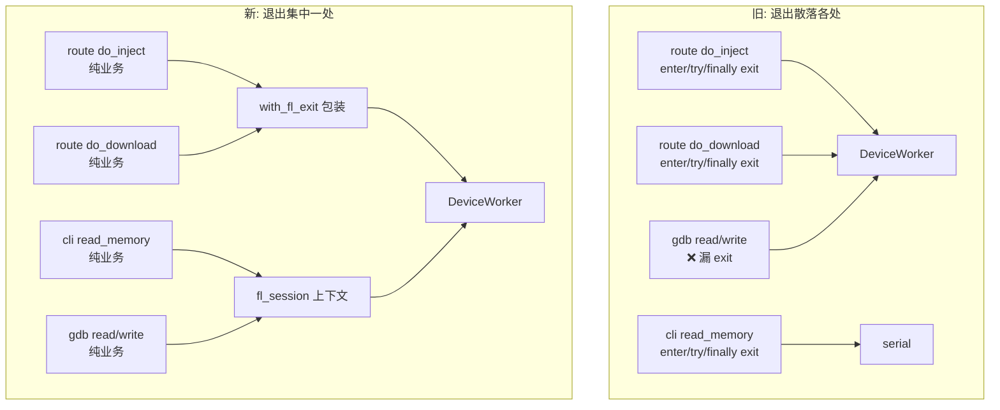
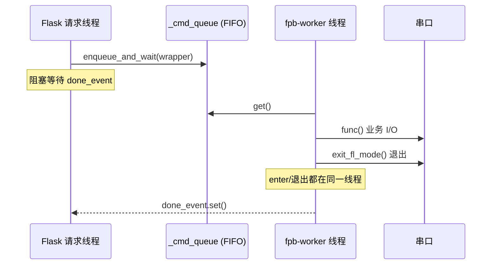

# fl 模式退出集中化 架构优化复盘

## 背景

NuttX 平台下，任何一条设备命令都会隐式进入 `fl` 交互模式（提示符 `fl>`）。
操作完成后必须显式退出，否则设备卡在 `fl>`，下一个工具（甚至控制台前的人）都无法正常使用。

进入 `fl` 模式是幂等的，退出才是那个"必须做且容易忘"的横切关注点。旧代码把
`enter_fl_mode()` / `exit_fl_mode()` 的配对**手写**在每一个调用点，散落在路由、
CLI、SDK、GDB 桥接多处，形成了典型的"配对易漏"反模式。

## 问题

### 1. 退出散乱、易漏

同一段 `enter → try → finally: exit` 模板在以下位置各写一遍：

- `app/routes/fpb.py`：inject / inject_multi / mem_read / mem_write / info
- `app/routes/transfer.py`：list / stat / mkdir / delete / rename / download
- `cli/commands_file_mem.py`：read / write / dump
- `cli/fpb_cli.py`：inject / unpatch / info / test_serial
- `client.py`：direct read / write

任何一处漏写 `exit_fl_mode()`，设备就会卡在 `fl>`。已经发现的两个真实缺陷：

- **GDB 内存读写**：走内存指令但没有退出，每次 GDB 访问后设备卡在 `fl>`。
- **route info**：手动 exit 位置不统一，异常路径下可能漏退。

### 2. 每块反复进出的担忧

文件传输是"多命令组合操作"（下载 = `fstat` → `fopen` → `fread` × N → `fcrc` → `fclose`）。
若在每个子命令里各自 enter/exit，会产生大量无意义的进出抖动。

## 优化方案

把"退出"这一个横切关注点**集中到一处**，进入保持幂等由协议层自理。

### 服务端路由：`with_fl_exit` 包装器

新增 `app/utils/device_op.py`：

```python
def with_fl_exit(func, keep_fl=False, fpb=None):
    def wrapped():
        try:
            return func()
        finally:
            if not keep_fl:
                target = fpb or get_fpb_inject()
                target.exit_fl_mode()   # 异常也不吞掉 func 的结果
    return wrapped
```

各路由的 `_run_serial_op` 统一接受 `keep_fl` / `fpb` 参数，用 `with_fl_exit` 包住业务函数。
业务函数 `do_*` 里**不再手写** enter/exit，只写纯业务逻辑。

关键点：`_run_serial_op` 仍保留各模块自己的 `run_in_device_worker` 派发（保证按模块 mock
worker 的测试不受影响），只是把工作函数换成被包装过的版本。

### CLI / SDK / GDB：`fl_session()` 上下文管理器

不走路由 `_run_serial_op` 的调用方（CLI 直连、SDK、GDB 桥接），用
`FPBInject.fl_session()` 上下文管理器：

```python
with fpb.fl_session():
    fpb.unpatch(...)
# 离开作用域时自动 exit_fl_mode()，异常也保证
```

### 一次进入、一次退出

因为进入幂等，整个多命令操作只在第一条命令时真正进入 `fl`，靠这里唯一的一次退出离开，
**不会出现每块反复进出**。传输一个大文件全程只有 1 次 enter + 1 次 exit。

### 架构对比



## 线程安全分析

结论：**没有引入线程安全问题。**

### 单一属主线程模型

所有串口访问都汇聚到唯一的 `DeviceWorker`（线程名 `fpb-worker`，`daemon=True`）。
它内部是一个 FIFO 命令队列 `_cmd_queue`，`_worker_loop` 串行取出并执行：



要点：

1. **退出发生在 worker 线程内**。`with_fl_exit` 的 `wrapped()` 是作为 `run_in_device_worker`
   的 `func` 提交进队列的，它的 `finally: exit_fl_mode()` 在 worker 线程里执行，
   和业务 I/O 是**同一个线程、同一次出队**，没有新增任何跨线程串口访问。

2. **`_in_fl_mode` 状态只在 worker 线程翻转**。`enter_fl_mode` / `exit_fl_mode` 读写
   `_protocol._in_fl_mode` 全部在 worker 线程串行发生，不存在竞态。

3. **请求线程只阻塞等待**。Flask 请求线程通过 `enqueue_and_wait` 提交后阻塞在
   `done_event` 上，不触碰串口。多个并发请求会在队列里排队，天然串行化。

4. **GDB 路径同理**。GDB 的 `read_memory_fn` / `write_memory_fn` 里的 `fl_session()`
   位于 `do_read` / `do_write` 内，而这两个函数经 `run_in_device_worker` 派发，
   退出同样落在 worker 线程。

即：新架构没有增加任何新的共享可变状态，也没有新增跨线程访问路径，
只是把"退出"从"每个调用点各写一遍"变成"包装器/上下文里写一遍"，执行时机和线程都不变。

## 对 fpb_cli 的影响

无负面影响。

- **CLI 直连模式**：单进程、单线程，`fl_session()` 就是普通的 try/finally 语法糖，
  行为与旧的手写 `enter/try/finally: exit` 完全等价。
- **CLI 代理模式（连服务端）**：CLI 只发 HTTP 请求，实际串口操作仍由服务端的
  `fpb-worker` 串行完成，退出策略与 GUI 路由共用同一套 `with_fl_exit`，一致且可靠。

CLI 各命令（inject / unpatch / info / test_serial / read / write / dump）均已改用
`fl_session()`，语义不变但保证了退出配对。

## 测试

- 新增 `tests/test_device_op.py`：覆盖 `with_fl_exit` 的正常返回、异常透传、`keep_fl`、
  显式 `fpb` 与默认 `get_fpb_inject()` 解析等场景。
- `tests/test_fpb_inject.py`：新增 `fl_session` 正常/异常退出用例，以及
  退出校验（bare-Enter 探测 `fl>` 是否仍在）用例。
- 路由测试去掉了对 `enter_fl_mode.assert_called` 的断言（进入现在由包装器隐式处理）。
- 后端全量套件通过，`./format.sh --lint` 干净。

## 收益

- 退出策略从 N 个调用点收敛到 2 个入口（`with_fl_exit` + `fl_session`），
  杜绝"漏写 exit"类缺陷。
- 修复了 GDB 内存访问后卡 `fl>` 的真实 bug。
- 多命令操作保持"一次进、一次出"，无进出抖动。
- 线程模型未变，无并发风险。
