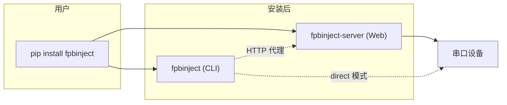
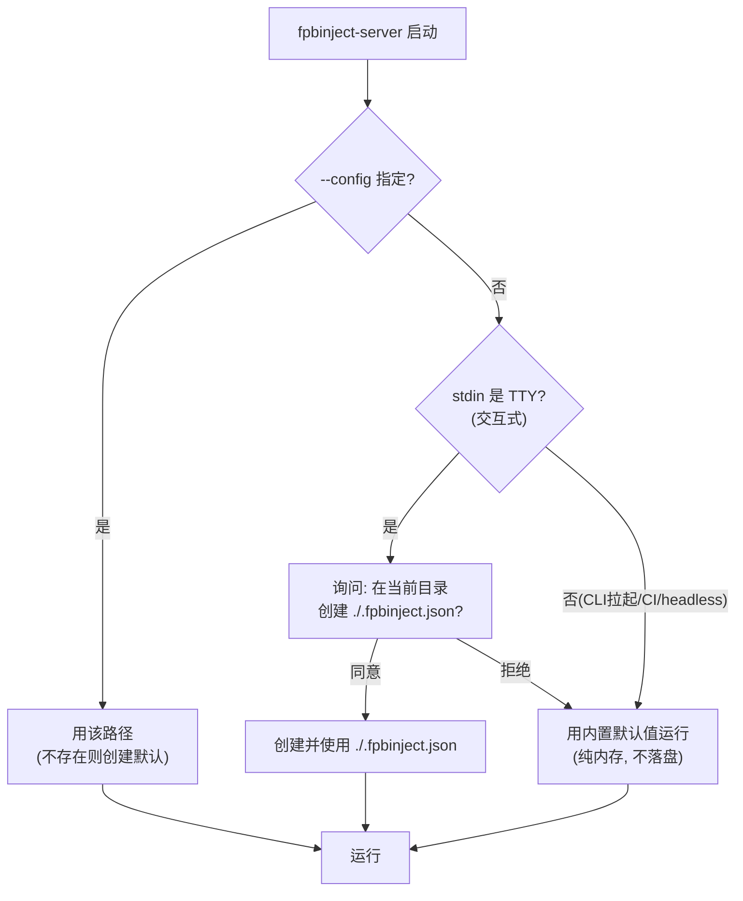
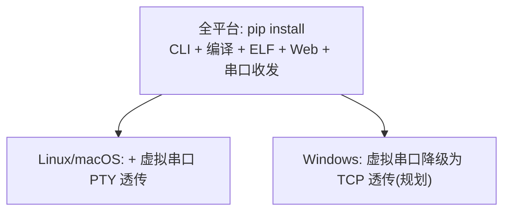

# FPBInject 打包与分发设计方案

**终极目标**：用户 `pip install fpbinject` 后即可使用，装完直接拥有 `fpbinject`（CLI）与 `fpbinject-server`（Web 服务）两个命令。

本文档给出从现状到 PyPI 发布的完整改造路径、配置管理策略，以及跨平台兼容性评估。

## 1. 现状与障碍

FPBInject 的 WebServer 位于 `Tools/WebServer/`，是一组**扁平的顶层模块**（`core/`、`cli/`、`app/`、`services/`、`utils/`、`main.py`、`fpb_inject.py`），依赖"以 `Tools/WebServer/` 为当前目录运行"这一隐式前提。

阻碍 `pip install` 的四个根本问题：

| # | 问题 | 后果 |
|---|------|------|
| 1 | 顶层模块非包（`import core.x`、`from cli.fpb_cli import ...`） | 装进 `site-packages` 后与其他包同名冲突（`core`/`app` 太通用） |
| 2 | `sys.path.insert` + `os.chdir(_SERVER_DIR)` + `__file__` 定位 | 打包后"自己的目录"概念消失，路径解析失效 |
| 3 | `config.json` / `.fpbinject_server_id` / `*.pid` 写在包目录 | `site-packages` 通常只读，写入即崩 |
| 4 | 无打包元数据（无 `pyproject.toml`），依赖散在 `Tools/requirements.txt` | 无法构建 wheel、无 entry point |

> 结论：`pip install` 的前提是**先把 WebServer 收进一个命名包 `fpbinject/`**。这是最大的一块工作，其余都是标准流程。

## 2. 目标形态



- `fpbinject analyze fw.elf foo`、`fpbinject inject ...` —— CLI，装完即用。
- `fpbinject-server --port /dev/ttyACM0` —— 启动 Web 服务。
- 前端资源（`templates/`、`static/`）随包分发，无需额外下载。

## 3. 包结构改造（第 0 步，工作量核心）

### 3.0 物理目录可以不动

**关键澄清**：包化**不要求搬移或重命名现有目录**。现有的 `Tools/WebServer/` 及其 `core/ cli/ app/ services/ utils/` 子结构**原样保留**。通过 setuptools 的 `package-dir` 把导入包名 `fpbinject` 映射到物理目录即可：

```toml
[tool.setuptools]
package-dir = { "fpbinject" = "Tools/WebServer" }

[tool.setuptools.packages.find]
where = ["Tools/WebServer"]
```

这样磁盘上还是 `Tools/WebServer/core/state.py`，但安装/导入时表现为 `fpbinject.core.state`。

区分两件事：

| | 是否需要改 | 说明 |
|---|:---:|------|
| **物理目录布局**（文件夹位置/层级） | ❌ 不动 | `package-dir` 映射即可，`core/cli/app/...` 全保留 |
| **import 语句**（`import core.x`） | ✅ 必改 | 装成 `fpbinject` 包后顶层 `core` 不可导入，须改 `from fpbinject.core import x` |

为什么 import 必须改：若保留顶层 `import core.x`，就得把 `core`/`app` 作为**顶层包**安装 —— 这恰恰会和其他库撞名（正是打包要解决的问题）。所以目录可以留，但内部引用要加 `fpbinject.` 前缀。

### 3.1 逻辑包视图（物理仍在 Tools/WebServer/）

```
fpbinject/  (= Tools/WebServer/, 经 package-dir 映射)
  __init__.py                  # __version__（复用现 version.py）
  __main__.py                  # python -m fpbinject → server
  main.py  fpb_inject.py  routes.py
  core/  cli/  app/  services/  utils/
  templates/                   # 打进包
  static/                      # 打进包（css/ js/ 及子目录）
```

> 注：`__init__.py`（含 `__version__`）需在 `Tools/WebServer/` 下新增；`version.py` 的值可被 `__init__.py` 复用。

### 3.2 导入改造（唯一的大改动面）

- 所有 `import core.x` → `from fpbinject.core import x`；`from cli.fpb_cli import ...` → `from fpbinject.cli.fpb_cli import ...`。
  - 也可用**包内相对导入**（`from ..core import x`），改动更机械，但绝对包名前缀可读性更好，二选一统一即可。
- 删除 `cli/fpb_cli.py` 里残留的 `sys.path.insert`。
- 删除 `os.chdir(_SERVER_DIR)`。

> 改动面大（几十处绝对导入），但有 **85% 测试覆盖率**兜底。建议单开分支 `refactor(pkg): convert to importable fpbinject package`，用 IDE 的"更新导入"或脚本批量替换，再跑全量测试验证。测试里的 `sys.path.insert(0, ...)` 可保留（测试仍以目录方式运行），或改为依赖已安装的包。

> ⚠️ **原子性约束（实测踩坑）**：一旦在 `Tools/WebServer/` 下放 `__init__.py`，pytest 会把该目录识别为包，导致同一模块被加载两次（如 `cli.fpb_cli` 与 `fpbinject.cli.fpb_cli` 成为不同对象），现有基于函数身份的断言（`test_fpb_cli_main_is_cli_main`）会失败。因此 **`__init__.py`/`__main__.py` 不能作为"惰性脚手架"提前落地**，必须与"import 全量迁移 + 测试调整（如统一 `conftest.py` 的 import 方式）"在同一次 S0 提交内完成。当前已提交的 `pyproject.toml` 是"目标蓝图"，S0 完成前 `python -m build` 不会成功（文件头有注明）。

### 3.3 静态资源定位

`app/__init__.py` 现用 `os.path.dirname(__file__)` 拼 `templates`/`static`。改为 `importlib.resources`：

```python
from importlib.resources import files

pkg_root = files("fpbinject")
app = Flask(
    __name__,
    template_folder=str(pkg_root / "templates"),
    static_folder=str(pkg_root / "static"),
)
```

### 3.4 可写文件迁出包目录

见 §4 配置管理。`config.json`、`.fpbinject_server_id`、`.cli_server_*.pid`、`log.txt` 都不能再落在包目录。

## 4. 配置管理策略

结合此前讨论的多设备/多项目诉求，采用**显式优先 + 首次交互创建**，不做 CWD 向上搜索（行为不透明），也不默认写全局 `~/.config`（多项目会互相覆盖）。

### 4.1 config 路径解析



规则：

1. **`--config <path>`**：一锤定音。不存在则以 schema 默认值创建。多设备/多项目各带各的，零覆盖。
2. **无 `--config` 且交互式**（`sys.stdin.isatty()`）：询问是否在**当前目录**创建 `./.fpbinject.json`。落点是用户看得见的地方，透明。
3. **无 `--config` 且非交互**（被 `server_proxy.launch_server` 用 `subprocess.Popen(..., stdout=DEVNULL)` 拉起、或 CI）：**绝不阻塞在 `input()`**，直接用内置默认值运行（不落盘）。
4. **拒绝创建**：用内置默认值运行、不落盘（宽容策略；"无 config 运行"本就是期望能力）。

> 关键约束：`input()` 只在 `sys.stdin.isatty()` 为真时调用。CLI 自动拉起 server 是非交互路径，必须走内存默认分支，否则会挂死。

### 4.2 为什么不搜 CWD、不默认全局

- **CWD 向上搜索**：不是慢，而是"到底用了哪份 config"不明确，且会被无关父目录的残留文件干扰。
- **默认 `~/.config/fpbinject/config.json`**：项目相关字段（`elf_path`/`compile_commands`/`toolchain`/`watch_dirs`）会在多项目间互相覆盖。

显式 `--config` + 首次交互创建，行为完全可预测，且天然支持"每项目/每设备一份 config"。

### 4.3 CLI 无 config 运行（现状已满足）

`fpb_cli` **当前就不读写任何 config** —— 它不 import `AppState`、不碰 `config.json`，用自带的轻量 `DeviceState`，参数全部来自命令行。

- **`--direct` 模式**：零 config、零持久状态，多项目/多设备天然隔离。
- **代理模式**：config 由 server 持有，CLI 只是瘦客户端。

因此配置改造**只影响 server**，CLI 侧无需改动。唯一衔接点：`server_proxy.launch_server` 拼命令行时，若 CLI 处于某项目上下文，可把 `--config` 透传给被拉起的 server；否则让 server 走非交互默认。

### 4.4 运行时可写文件落点

| 文件 | 现状 | 目标 |
|------|------|------|
| `config.json` | 包目录 | `--config` 指定 / `./.fpbinject.json` / 内存 |
| `.fpbinject_server_id` | 包目录 | `platformdirs.user_state_dir("fpbinject")` |
| `.cli_server_*.pid` | 包目录 | `user_state_dir` 或 `tempfile.gettempdir()` |
| `log.txt` | 包目录（已 gitignore） | 用户指定 / `user_state_dir` |

引入 `platformdirs` 依赖统一处理跨平台目录（Linux `~/.local/state`、macOS `~/Library/...`、Windows `%LOCALAPPDATA%`）。

## 5. pyproject.toml

放仓库根（或 `Tools/WebServer/`，取决于包最终落点）：

```toml
[build-system]
requires = ["setuptools>=64", "wheel"]
build-backend = "setuptools.build_meta"

[project]
name = "fpbinject"                       # 发布前先在 pypi.org 查重名
dynamic = ["version"]
description = "Runtime code injection for ARM Cortex-M via the FPB hardware unit"
readme = "README.md"
requires-python = ">=3.8"
license = { text = "MIT" }
authors = [{ name = "VIFEX", email = "vifextech@foxmail.com" }]
dependencies = [
  "Flask",
  "Flask-Cors",
  "pyserial",
  "pygdbmi",
  "watchdog",
  "tree_sitter",
  "zeroconf>=0.131",
  "platformdirs",                        # 跨平台配置/状态目录
]

[project.optional-dependencies]
dev = ["pytest", "coverage", "black", "flake8"]

[project.urls]
Homepage = "https://github.com/FASTSHIFT/FPBInject"

[project.scripts]
fpbinject = "fpbinject.cli.fpb_cli:main"
fpbinject-server = "fpbinject.main:main"

[tool.setuptools.dynamic]
version = { attr = "fpbinject.__version__" }

[tool.setuptools]
package-dir = { "fpbinject" = "Tools/WebServer" }   # 物理目录不搬家

[tool.setuptools.packages.find]
where = ["Tools/WebServer"]

[tool.setuptools.package-data]
fpbinject = [
  "templates/*.html",
  "templates/**/*.html",
  "static/css/*.css",
  "static/js/**/*.js",
  "static/js/**/*.json",
]
```

要点：

- `[project.scripts]` 生成 `fpbinject` / `fpbinject-server` 命令，`pip install` 后即可用。
- 前端资源必须在 `package-data` 里，否则装完没网页。
- **工具链不进 `dependencies`**：ARM GCC、Ghidra 是外部程序，运行时检测（沿用现有 mcp/ghidra 的运行时探测思路）；`mcp` 已移除，不再是依赖。

## 6. 构建与发布流程


### 6.1 本地验证（发布前必做）

```bash
pip install build twine
python -m build
python -m venv /tmp/t && /tmp/t/bin/pip install dist/fpbinject-*.whl
/tmp/t/bin/fpbinject --version
/tmp/t/bin/fpbinject-server --help
```

### 6.2 TestPyPI 演练

```bash
twine upload --repository testpypi dist/*
pip install --index-url https://test.pypi.org/simple/ fpbinject
```

### 6.3 正式发布 + 自动化

用 GitHub Actions + PyPI **Trusted Publishing (OIDC)**，打 tag 自动发布，免管 token（与现有 `v1.6.x` tag 习惯衔接）：

```yaml
# .github/workflows/publish.yml
on:
  push:
    tags: ["v*"]
jobs:
  publish:
    runs-on: ubuntu-latest
    permissions:
      id-token: write            # Trusted Publishing 必需
    steps:
      - uses: actions/checkout@v4
      - uses: actions/setup-python@v5
        with: { python-version: "3.11" }
      - run: pip install build && python -m build
      - uses: pypa/gh-action-pypi-publish@release/v1
```

### 6.4 过渡期：不上 PyPI 也能装

包化 + `pyproject.toml` 完成后，无需注册 PyPI 即可：

```bash
pipx install git+https://github.com/FASTSHIFT/FPBInject
```

推荐 `pipx`（隔离虚拟环境、暴露命令、不污染全局）作为 CLI/服务类工具的安装方式。

## 7. 跨平台兼容性评估

`pip install` 天然是跨平台的，但 FPBInject 有若干 **POSIX 假设**需要在打包时正视。

### 7.1 现状扫描结果

| 模块 | 平台相关点 | Linux | macOS | Windows |
|------|-----------|:-----:|:-----:|:-------:|
| `utils/port_lock.py` | 已用 `sys.platform` 分支 `fcntl` / `msvcrt` | ✅ | ✅ | ✅ |
| `services/virtual_serial.py` | `os.openpty` / `os.symlink` / `/tmp` / `tty` | ✅ | ✅ | ❌ 无 PTY |
| `utils/serial.py` | `/dev/ttyS*` 过滤、`glob /dev/ttyCH341USB*` | ✅ | ⚠️ 命名不同 | ⚠️ COM 口 |
| 可写文件路径 | `/tmp`、包目录 | ✅ | ✅ | ❌ 无 `/tmp` |
| 交叉编译 | 调用 `arm-none-eabi-gcc` | ✅ | ✅ | ✅（需装工具链） |

结论：**核心功能（编译、ELF 分析、串口协议、注入、Web/CLI）跨平台可用**；**虚拟串口透传是唯一的强 POSIX 依赖**。

### 7.2 需要处理的点

1. **虚拟串口（PTY）—— Windows 不支持**
   - 已有平台守卫：`start()` 检查 `hasattr(os, "openpty")`，缺失时返回明确错误，不会崩。
   - `_SYMLINK_DIR = "/tmp"` 硬编码 → 改用 `tempfile.gettempdir()`（Windows 为 `%TEMP%`）；不过 Windows 无 PTY，此路径本就不会走到。
   - Windows/跨平台方案：TCP 透传（`socat` / `rfc2217://`），已在虚拟串口设计文档 §7 规划为后续项。

2. **串口扫描的设备名假设**（`utils/serial.py`）
   - `/dev/ttyS*` 过滤、`/dev/ttyCH341USB*` glob 是 Linux 专属。macOS 是 `/dev/cu.*`，Windows 是 `COM*`。
   - pyserial 的 `comports()` 本身跨平台；应把 Linux 专属的过滤/补充逻辑用 `sys.platform` 收敛，避免在其他平台误伤。

3. **临时目录 / 状态目录**
   - 全面改用 `platformdirs` + `tempfile.gettempdir()`，消除 `/tmp` 硬编码。

4. **文件锁** —— 已跨平台（`port_lock.py` 已处理 `msvcrt`），无需改动。

### 7.3 分层支持策略



- **Tier 1（全平台）**：CLI、交叉编译、ELF 分析/反汇编、串口协议、注入、Web GUI、文件传输。
- **Tier 2（Linux/macOS）**：PTY 虚拟串口全量透传。
- **Windows 虚拟串口**：待 TCP 透传落地后补齐；在此之前明确文档标注"Windows 暂不支持虚拟串口"。

### 7.4 wheel 类型

FPBInject 纯 Python（依赖里 `tree_sitter` 等有 C 扩展，但由其自身提供 wheel），因此 FPBInject 自身构建 **纯 Python wheel（`py3-none-any`）** 即可，无需为各平台单独编译。跨平台差异全在运行时行为，不在构建产物。

## 8. 实施计划

| 阶段 | 内容 | 依赖 | 风险 |
|------|------|------|------|
| S0 | 包化：模块收进 `fpbinject/`，改导入，去 `sys.path`/`chdir`，资源用 `importlib.resources` | — | **高**（面广，靠测试兜底） |
| S1 | 配置改造：`resolve_config_path`、`--config`、交互创建、`platformdirs` 落点迁移 | S0 | 中 |
| S2 | 跨平台收敛：`/tmp`→`tempfile`、串口扫描按 `sys.platform` 分支 | S0 | 低 |
| S3 | `pyproject.toml` + entry points + `__init__/__main__` | S0 | 低 |
| S4 | 本地干净环境验证 + `pipx install git+...` 过渡方案 | S3 | 低 |
| S5 | TestPyPI 演练 → 正式 PyPI → tag 触发 Trusted Publishing | S4 | 低 |
| S6 | Windows 虚拟串口 TCP 透传（可选，独立） | — | 中 |

建议顺序：**S0 单独分支做透（最关键，全靠测试保驾）→ S1/S2/S3 并行 → S4 验证 → S5 发布**。S6 独立推进。

## 9. 决策待确认

1. ~~包最终落点~~ **已定**：物理目录保持 `Tools/WebServer/` 不动，用 `package-dir` 映射为 `fpbinject` 包（见 §3.0）。
2. ~~PyPI 包名~~ **已定**：`fpbinject`（PyPI 查重通过，2026-08 未被占用）。命令名同为 `fpbinject` / `fpbinject-server`。
3. ~~拒绝创建 config~~ **已定**：用内置默认值运行、不落盘（宽容策略）。
4. ~~首次创建文件名~~ **已定**：隐藏式 `./.fpbinject.json`。
5. ~~最低 Python 版本~~ **已定**：`>=3.8`。

## 10. 附：不改架构的前提

本方案的"多设备/多项目"仍是**多实例模型**（每个 `fpbinject-server` 进程管一个设备+一份 config）。若未来要"单进程同时管多个设备"，需将 `AppState` 从单例改为 `devices: dict[port, DeviceState]`，config 也随之变为"每设备一段"——那是另一量级的重构，不在本方案范围内。
