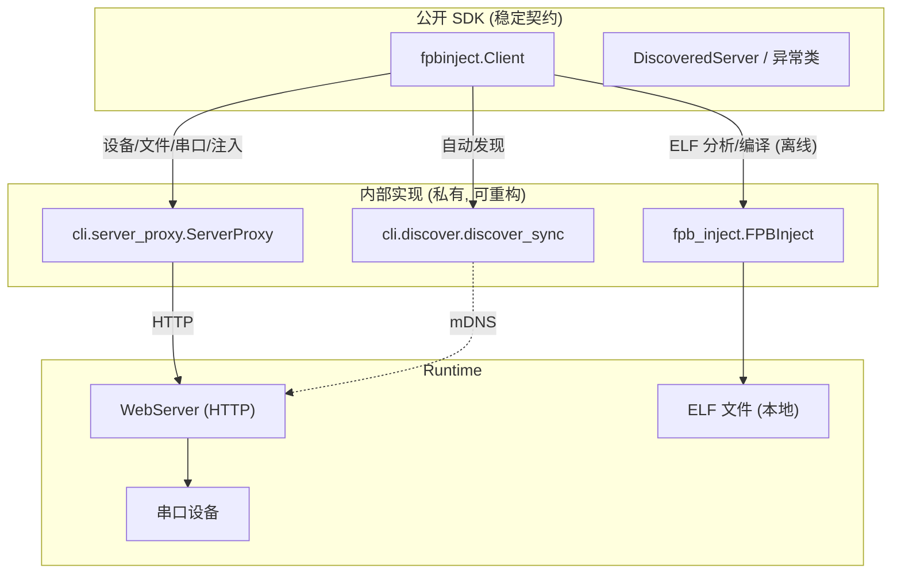

# FPBInject 对外 Python SDK 设计方案

## 1. 背景与动机

FPBInject 已发布为 PyPI 包（`pip install fpbinject`）。但目前外部脚本调用设备能力的方式，是直接“戳”内部模块：

```python
# 反面示例：依赖内部实现，非公开、易碎
import sys
sys.path.insert(0, "/path/to/FPBInject/Tools/WebServer")
from cli.server_proxy import ServerProxy       # 内部类
from cli.discover import discover_sync          # 内部函数
```

问题：

- **耦合内部实现**：`cli.server_proxy` / `cli.discover` 是 CLI 的内部细节，随时可能重构，破坏外部脚本。
- **需要 `sys.path` hack**：使用者要知道源码物理路径，装了 PyPI 包也用不上。
- **能力分散**：ELF 分析走 `FPBInject` 类、设备操作走 `ServerProxy`、发现走 `discover_sync`，三套入口，使用者要自己拼。
- **无稳定契约**：没有版本化的公开 API，无法保证向后兼容。

目标：提供一个**正式、稳定、脱敏、覆盖全部 CLI 能力**的对外 SDK 门面：

```python
from fpbinject import Client

# 自动发现本机/局域网内的 WebServer（等价于 fpb_cli 的默认行为）
client = Client.discover(token="<token>")

client.serial_send("help\r\n")
print(client.serial_read()["raw_data"])
client.file_list("/data")
info = client.info()
```

## 2. 设计原则

1. **单一公开入口**：`from fpbinject import Client`（以及少量数据类/异常）。所有 `cli.*`、`core.*`、`app.*` 均视为**私有实现**，不进公开契约。
2. **覆盖全部 CLI 能力**：CLI 能做的，SDK 都能做（见 §4 能力矩阵）。
3. **三种运行模式统一**：
   - **代理模式**（默认）：连到 WebServer（本机或远程），设备操作走 HTTP。
   - **直连模式**：SDK 直接打开串口驱动设备，不需要 WebServer（等价 `fpbinject --port ... --direct`）。适合无桌面/CI 脚本，少起一个进程。唯一限制是虚拟串口（vserial）——PTY 必须由常驻进程托管，一次性直连客户端退出后节点即消失，故仅代理模式支持。
   - **离线模式**：纯 ELF 分析（analyze/disasm/compile 等），不需要设备或服务器。
4. **稳定契约 + 语义化版本**：公开 API 变更遵循 SemVer；返回值结构文档化。
5. **薄门面，不重复造轮子**：`Client` 内部委托现有的 `ServerProxy` / `FPBInject` / `FileTransfer` / `discover_sync` / `stop_cli_server`，只做统一封装与稳定化，不改设备协议。直连模式复用 CLI `--direct` 相同的 `DeviceState` + core 类路径。
6. **脱敏**：SDK 与文档不含任何具体项目/芯片/内部路径信息，仅用中性占位符。

## 3. 公开 API 表面

```python
# fpbinject/__init__.py 导出
from fpbinject import (
    Client,              # 主门面
    FPBError,            # 异常基类
    AuthError,           # 401/403
    ServerUnavailable,   # 服务器不可达
    DeviceNotConnected,  # 设备未连接
    DiscoveredServer,    # discover() 结果的数据类
)
```

### 3.1 构造与连接

```python
class Client:
    def __init__(self, base_url="http://127.0.0.1:5500", token=None, *, timeout=30):
        """直连指定 WebServer（代理模式）。"""

    @classmethod
    def discover(cls, token=None, *, timeout=3.0, handle=None):
        """通过 mDNS 自动发现 WebServer 并连接。
        - handle=None：局域网内唯一服务器时直接用；多个则抛错并列出。
        - handle="host:port" 或 "host"：定位指定服务器。
        等价于 fpb_cli 无 --server 时的默认发现行为。
        """

    @classmethod
    def direct(cls, port, baudrate=115200, *, toolchain_path=None):
        """直连模式：本进程打开串口驱动设备，不连 WebServer。
        等价 `fpbinject --port <port> --direct`。会对串口加 PortLock，
        用 close()/上下文管理器释放。不支持 vserial（见 §4）。
        """

    @classmethod
    def offline(cls, *, toolchain_path=None):
        """离线模式：只做 ELF 分析/编译，不连设备/服务器。"""

    @staticmethod
    def list_servers(timeout=3.0) -> list["DiscoveredServer"]:
        """列出局域网内可见的 WebServer（等价 `fpb_cli discover`）。"""

    @staticmethod
    def stop_server(port=5500) -> dict:
        """停止 CLI 后台拉起的 WebServer（等价 `fpb_cli server-stop`）。"""

    def ensure_server(self) -> bool:
        """本机无服务器时自动拉起（等价 ServerProxy.ensure_server）。"""

    def close(self) -> None:
        """释放资源；直连模式下关闭串口并释放 PortLock。"""

    @property
    def connected(self) -> bool: ...
    def status(self) -> dict: ...
```

### 3.2 token 来源（与 CLI 一致）

优先级：显式 `token=` 参数 > 环境变量 `FPB_TOKEN`。token 不经 mDNS 传播（安全），需带外获取（服务器启动日志）。

## 4. 能力矩阵（SDK ↔ CLI 一一对应）

模式列含义：**代理**=`Client`/`discover`，**直连**=`Client.direct`，**离线**=`Client.offline`。

| 分类 | SDK 方法 | 对应 CLI 子命令 | 模式 |
|------|----------|-----------------|------|
| **ELF 分析** | `analyze(elf, func)` | `analyze` | 代理·直连·离线 |
| | `disasm(elf, func)` | `disasm` | 代理·直连·离线 |
| | `decompile(elf, func)` | `decompile` | 代理·直连·离线（需 Ghidra） |
| | `signature(elf, func)` | `signature` | 代理·直连·离线 |
| | `search(elf, pattern)` | `search` | 代理·直连·离线 |
| | `get_symbols(elf, filter=None, limit=0)` | `get-symbols` | 代理·直连·离线 |
| | `compile(source, *, elf=None, base_addr=..., compile_commands=None)` | `compile` | 代理·直连·离线 |
| **设备信息** | `info()` | `info` | 代理·直连 |
| | `test_serial(...)` | `test-serial` | 代理·直连 |
| **注入** | `inject(target_func, source, *, elf=None, patch_mode="trampoline", comp=-1)` | `inject` | 代理·直连 |
| | `unpatch(comp=0, all=False)` | `unpatch` | 代理·直连 |
| **内存** | `mem_read(addr, length, fmt="hex")` | `mem-read` | 代理·直连 |
| | `mem_write(addr, hexdata)` | `mem-write` | 代理·直连 |
| | `mem_dump(addr, length, out_path)` | `mem-dump` | 代理·直连 |
| **串口** | `serial_send(data)` | `serial-send` | 代理·直连 |
| | `serial_read(since=0)` | `serial-read` | 代理·直连 |
| **文件** | `file_list(path="/")` | `file-list` | 代理·直连 |
| | `file_stat(path)` | `file-stat` | 代理·直连 |
| | `file_download(remote, local)` | `file-download` | 代理·直连 |
| | `file_upload(local, remote)` | `file-upload` | 代理·直连 |
| | `file_remove(path)` | `file-remove` | 代理·直连 |
| | `file_mkdir(path)` | `file-mkdir` | 代理·直连 |
| | `file_rename(old, new)` | `file-rename` | 代理·直连 |
| **连接** | `Client.direct(port, baudrate=...)` | `--port ... --direct` | 直连 |
| | `connect(port, baudrate=...)` | `connect` | 代理 |
| | `disconnect()` | `disconnect` | 代理 |
| **虚拟串口** | `vserial_start(symlink=None)` | `vserial-start` | 代理 |
| | `vserial_status()` | `vserial-status` | 代理 |
| | `vserial_stop()` | `vserial-stop` | 代理 |
| **发现** | `Client.discover()` / `Client.list_servers()` | `discover` | — |
| **服务器管理** | `Client.stop_server(port=5500)` | `server-stop` | 静态 |

> 覆盖率：CLI 的每个子命令都有对应 SDK 方法（含 `--direct` 与 `server-stop`）。SDK 是 CLI 的超集入口（多了 `ensure_server`、`status`、上下文管理等便利能力）。唯一的模式差异是虚拟串口仅代理模式可用（PTY 需常驻进程托管）。

## 5. 架构



要点：`Client` 是**门面（Facade）**，把三个内部组件收敛成一个稳定入口。内部组件保持不变、可自由重构，只要 `Client` 契约不破。

## 6. 使用示例（脱敏）

### 6.1 自动发现 + 设备操作（替代文档里的 sys.path hack）

```python
import os
from fpbinject import Client

client = Client.discover(token=os.environ.get("FPB_TOKEN"))

# 唤醒设备后发命令（file_stat 可唤醒，serial_send 不行——见 §7 注意事项）
client.file_stat("/")
client.serial_send("help\r\n")
logs = client.serial_read()["raw_data"]
print(logs)

client.file_list("/data")
```

### 6.2 连接指定服务器（代理模式）

```python
from fpbinject import Client
client = Client("http://<host>:<port>", token="<token>")
print(client.info())
```

### 6.3 直连串口（无需 WebServer）

```python
from fpbinject import Client

# 少起一个进程：本进程直接开串口驱动设备。
with Client.direct("/dev/ttyACM0", baudrate=115200) as dev:
    print(dev.info())
    dev.inject("target_function", "patch.c", elf="firmware.elf")
    dev.serial_send("help\r\n")
    print(dev.serial_read()["raw_data"])
# 退出 with 自动关闭串口并释放 PortLock；vserial 不可用（需常驻进程）。
```

### 6.4 离线 ELF 分析（无需设备）

```python
from fpbinject import Client
c = Client.offline(toolchain_path="/opt/<toolchain>/bin")
print(c.signature("firmware.elf", "target_function"))
print(c.disasm("firmware.elf", "target_function")["disasm"])
```

### 6.4 上下文管理 + 自动拉起

```python
from fpbinject import Client

with Client() as client:      # 退出时自动清理（如自动拉起的 server）
    client.ensure_server()    # 本机没 server 就拉起
    client.inject("target_function", "patch.c", elf="firmware.elf")
```

### 6.5 增量读日志（游标）

```python
cur = client.serial_read()["raw_next"]
client.serial_send("run_test\r\n")
delta = client.serial_read(since=cur)["raw_data"]
```

## 7. 返回值与错误约定

- **返回值**：透传 WebServer 的 JSON（`dict`），结构与 REST API 一致（文档化关键字段：`success`、`raw_data`/`raw_next`、`entries`、`info` 等）。SDK 不重塑结构，降低认知负担。
- **异常**：
  - `AuthError`：401/403（token 缺失或错误）。
  - `ServerUnavailable`：服务器不可达（连接失败/超时）。
  - `DeviceNotConnected`：需要设备的操作但设备未连接。
  - `FPBError`：其它错误基类。
  - 离线方法的错误（如 ELF 不存在）直接抛，不吞。
- **DPM 唤醒注意**：某些设备会进入深度睡眠，`serial_send` 不唤醒，`file_stat`/`file_list` 可唤醒。SDK 文档明确此约定，并可提供 `wake()` 便捷方法（内部调 `file_stat("/")`）。

## 8. 兼容性与迁移

- **不破坏现有 CLI / ServerProxy**：SDK 是新增门面，内部继续复用它们。
- **迁移指引**：把
  ```python
  sys.path.insert(0, ".../Tools/WebServer"); from cli.server_proxy import ServerProxy
  proxy = ServerProxy(base_url=..., token=...)
  ```
  换成
  ```python
  from fpbinject import Client
  client = Client(base_url=..., token=...)   # 或 Client.discover(...)
  ```
  方法名尽量与 `ServerProxy` 保持一致（`serial_send`/`file_list`/`info` 等原样），降低迁移成本。
- **SemVer**：`Client` 的公开方法签名进入语义化版本管理；内部模块不受此约束。

## 9. 实施计划

| 阶段 | 内容 | 改动范围 | 风险 |
|------|------|----------|------|
| P1 | 新增 `fpbinject/client.py`：`Client` 门面 + 异常 + `DiscoveredServer`，委托现有组件 | 新增文件 | 低 |
| P2 | `fpbinject/__init__.py` 导出公开符号 | 改 1 文件 | 低 |
| P3 | 补全能力矩阵中尚未在 `ServerProxy` 暴露的方法（如 `mem_dump`、`get_symbols` 的离线封装） | 视缺口 | 低 |
| P4 | 单元测试：mock HTTP + 离线 ELF，覆盖每个公开方法 | 新增 `tests/test_client.py` | 低 |
| P5 | 文档：README「SDK 用法」章节 + docstring | 文档 | 低 |
| P6 | 更新对外文档，把 `sys.path + cli.*` 示例替换为 `from fpbinject import Client` | 文档 | 低 |

## 10. 决策（已定）与落地状态

1. ~~主入口命名~~ **已定**：`Client`（`from fpbinject import Client`）。
2. ~~返回值~~ **已定**：透传 `dict`（即 WebServer REST 的 JSON 解析结果，与 CLI/REST 字段一致；后续可增量引入强类型）。
3. ~~离线 compile/decompile~~ **已定**：纳入接口，运行时检测工具链/Ghidra 缺失并抛清晰错误。

**落地状态（已实现）：**

- `fpbinject/client.py`：`Client` 门面 + 异常（`FPBError`/`AuthError`/`ServerUnavailable`/`DeviceNotConnected`）+ `DiscoveredServer`
- `fpbinject/__init__.py`：导出上述公开符号
- `tests/test_client.py`：24 项测试（构造/发现/代理方法 mock server/离线方法/**CLI↔SDK 能力对齐校验**）
- 覆盖 §4 能力矩阵全部条目；`mem_dump` 由 `mem_read(raw)` 组合实现，`get_symbols` 走离线 FPBInject
- 全套测试通过、format+lint 干净
