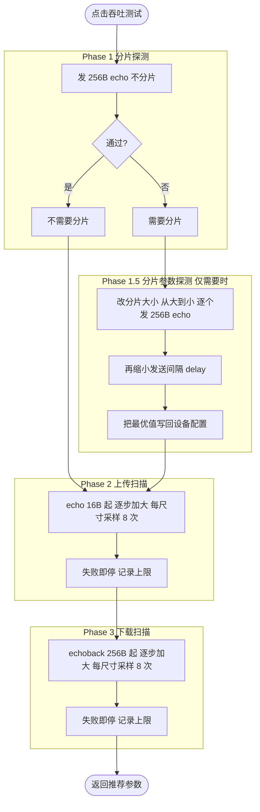
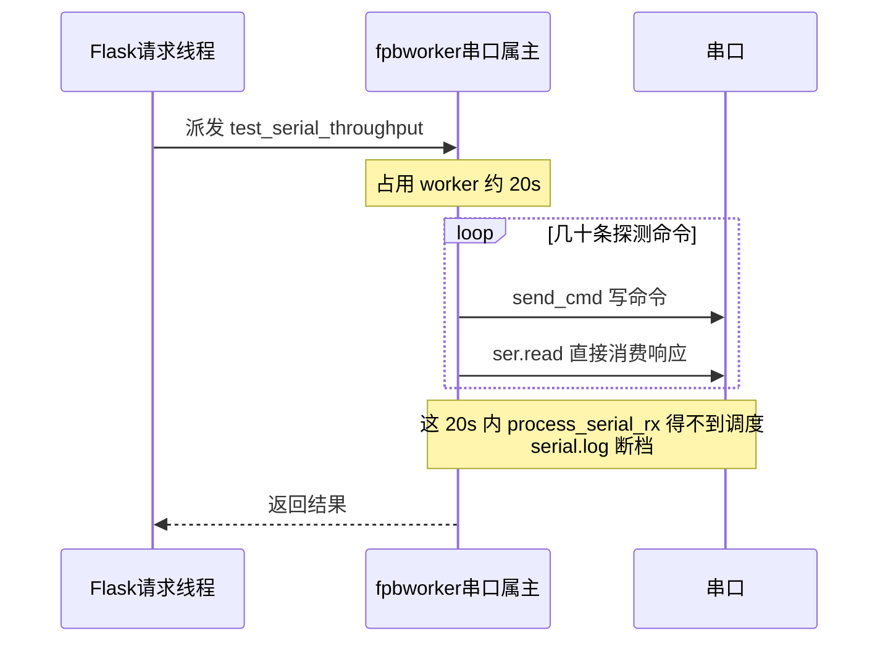
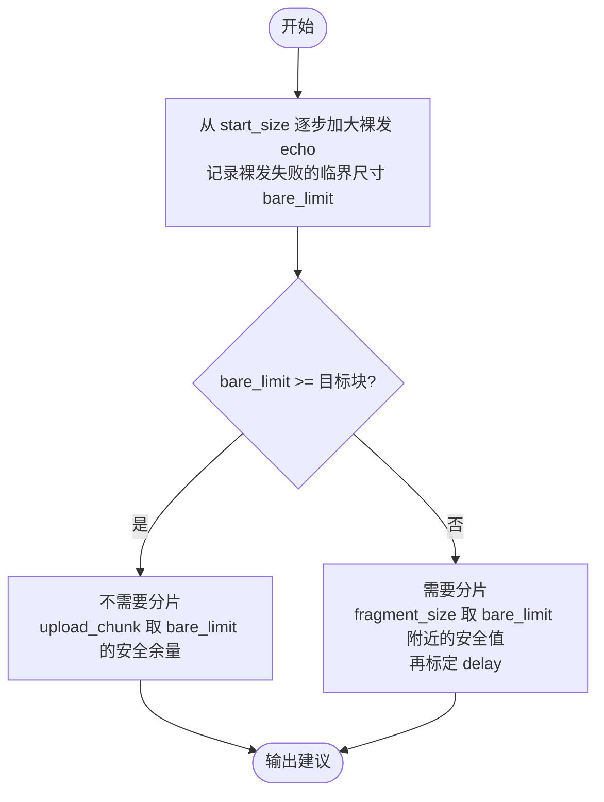
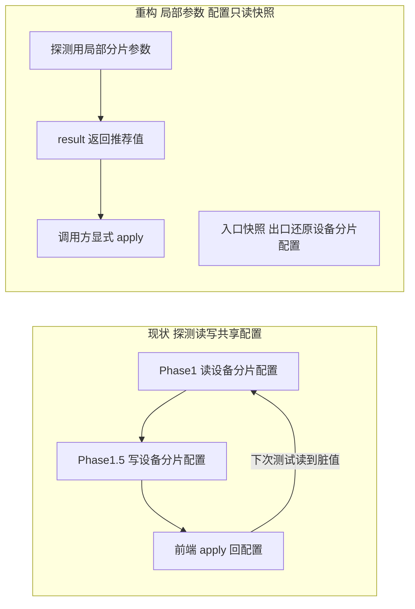

# 串口吞吐测试（Throughput / 联通测试）重构设计

## 背景

Web UI 与 CLI 的"吞吐测试 / 联通测试"按钮会调用
`FPBProtocol.test_serial_throughput()`，通过一组探测命令自动标定三个串口传输
参数：

- `serial_tx_fragment_size` / `serial_tx_fragment_delay`（PC→设备 分片发送）
- `upload_chunk_size`（上传每块字节数）
- `download_chunk_size`（下载每块字节数）

标定结果返回给前端，由用户确认后写入配置，供文件传输等功能使用。

实测该功能**不稳定**：连续点击会"一次好、一次坏"，坏的时候一堆 CRC 错误、
命令粘连、甚至整段串口日志丢失。文件传输本身一直正常，问题定位在吞吐测试自身。

本文分析现状根因并给出重构方案。

---

## 一、现状分析

### 1.1 探测流程（当前实现）

- `echo`：PC 发一条携带 N 字节数据的命令，设备回 CRC。压 **PC→设备** 方向
  （设备 shell 输入缓冲）。
- `echoback`：PC 发一条极短请求（`fl -c echoback -l N`），设备回 N 字节数据。
  压 **设备→PC** 方向。

### 1.2 执行线程模型

所有串口访问都汇聚到唯一的 `fpb-worker` 线程（见 `services/device_worker.py`）。
吞吐测试整段通过 `run_in_device_worker()` 派发，在该线程里**一口气串行跑完
几十条 `send_cmd`**，耗时可达 ~20 秒。

`serial.log` 由 worker 主循环里的 `_process_serial_rx()` 记录，它和吞吐测试
**在同一个线程**。测试独占 worker 期间，`_process_serial_rx` 完全不运行。

### 1.3 已实测确认的根因

| # | 根因 | 证据 | 影响 |
|---|------|------|------|
| R1 | **Phase 1 上来就发 256B 不分片**，对 128B RX 缓冲的设备必然溢出 | 设备回 `Available commands...`、`uart app buffer len 128` | 每次测试都主动把设备推入过载，污染后续所有阶段 |
| R1b | **回归引入**：256B 固定探测是 `34718b4`（2026-03-13，"3-phase throughput test"重构）新加的。它之前的实现（`34718b4~1`）本是 `start_size=16` 从小到大扫描——即那次三阶段重构把原本合理的"从小到大"改成了"上来 256B 拍脑袋判分片" | `git log -S _phase_fragment_probe`；`34718b4~1` 的 `test_serial_throughput` 用 `while test_size <= max_size` 从 16B 起 | 本次重构本质是回到"从小到大扫描"的思路（见 3.1） |
| R2 | **分片配置是共享持久状态，探测却直接读写它** | ENTER 时 `frag_size` 在 128↔0 间跳变，Phase1 判定随之翻转 | "一次好一次坏"的直接来源（已用快照/基线验证可消除，但只是治标） |
| R3 | **过载后设备处理严重滞后，命令粘连** | `ECHO 504 Bytes`（两条 256B 命令被当成一条）、请求 304B 却回 231B | 请求/响应错位且**自我维持**，CRC 恒错 |
| R4 | **`send_cmd` 无请求-响应关联** | 响应结尾是 `fl>` 而非 `[FLEND]`，读循环等超时后抓滑动窗口，抓到上一条响应 | 错位一旦发生无法自愈，只能靠 retry，反而加剧 |
| R5 | **worker 线程被独占 ~20s，`serial.log` 断档** | serial.log 出现 `17:57:17 → 17:57:37` 的 20s 空洞 | 关键诊断信息丢失；探测的 echo/echoback 因走 `ser.read` 直接消费，从不进日志 |
| R6 | **Phase 1.5 直接改 `device.frag_*` 且成功时不还原** | EXIT 前 device 上残留探测值 | 泄漏到下一次测试 + 被前端 apply 回配置，与 R2 形成振荡环 |

根因可归为三类：
- **探测策略缺陷**（R1、R6）：起点选得差、把中间态当结果持久化。
- **状态污染**（R2、R6）：探测读写共享持久配置，跨生命周期互相干扰。
- **传输层缺陷**（R3、R4、R5）：过载不可自愈、无响应边界、独占线程饿死日志。

### 1.4 为什么文件传输不受影响

文件传输用的是**已标定好的稳定参数**，且每条 `fwrite`/`fread` 都带 CRC 和
逐块重试；它从不"裸发探测"，也不读写分片配置去做判定。所以同一套 `send_cmd`
在文件传输下正常，在吞吐测试下暴露问题——问题在**吞吐测试的用法**，不在传输本身。

### 1.5 分片（TX fragmentation）的真正意义 + Phase 1 探测尺寸的取舍

**关键澄清**：分片的意义**不是**"发大命令时切小块"，而是**当设备的
DMA/UART 接收缓冲连一条最小命令都容不下（会丢字节）时，靠"发一小片 → 等一下 →
再发下一片"这种带节流的发送方式把命令喂进去的 workaround**。也就是说，分片要解决
的正是"**最小指令**都塞不下"的场景。

由此推出探测策略的正确取向：

- **判断"要不要分片"应该在 16B（最小命令）下做**，而不是用 256B。因为分片针对的
  就是"最小命令都失败"的设备——只有当 16B 裸发都失败时，才真正需要分片。用 256B
  探测，只是探到了"设备缓冲 < 256B"这种**几乎所有设备都成立**的普通情况，把它误
  当成"需要分片"，既不准又每次打爆设备（R1）。
- **判断"要不要分片"与"分片参数探测（Phase 1.5）"都应基于 16B**：Phase 1 用 16B
  裸发判定需不需要；若需要，Phase 1.5 也应在 16B 这个"最小命令"尺度上找能让它成功
  的最大分片片段和最小间隔。用 256B 去做分片参数探测同样是错的靶子。

**当前已落地的临时修复**（commit `3a57ccb`）：Phase 1 首发探测尺寸 256B → **16B**。
16B echo 命令行 ~46 字节，稳落在常见 128B 缓冲内，判定确定，"一好一坏"消失。

**已知取舍 / 遗留**：
- Phase 1.5 分片参数探测目前仍用 256B echo 作为验证载荷（`_phase_fragment_size_probe`
  里的 `_probe_echo(256, ...)`），与"分片应针对最小命令"的原则不符，应改为在 16B
  尺度上探测。列入 3.1 重构。
- 对**裸发就能过 16B**的正常设备，Phase 1 将恒判"不需要分片"，分片路径不触发——
  这是符合分片定义的正确行为（这类设备本就不需要分片）。只有"16B 裸发都丢字节"的
  设备才会进入分片探测。

---

## 二、设计目标

1. **确定性**：同样的设备、同样的链路，多次运行结果一致，不再"一好一坏"。
2. **非破坏性**：探测过程不主动把设备打到过载；即使触发失败也能干净恢复。
3. **无状态泄漏**：探测只用局部变量，绝不读写共享持久配置；推荐值仅通过返回值
   交给调用方决定是否 apply。
4. **可观测**：探测流量记入 `serial.log`；worker 不被长时间独占到饿死记录。
5. **改动可控**：优先收敛在 `serial_protocol.py` 的吞吐测试路径内，不动文件传输
   等已验证稳定的通用 `send_cmd` 行为（除非明确评估安全）。

---

## 三、重构方案

### 3.1 探测策略：从小到大的单次裸发扫描（治 R1、R6）

用一次**从小到大的裸发（不分片）扫描**同时回答"要不要分片 / 分片多大 / 上传块
多大"，取代"先拍 256B 判断 + 再单独探分片"的两段式。

要点：
- **从小到大**，探到失败临界就停，不会像现在一上来就用一个"保证打爆"的尺寸。
- "要不要分片"是裸发临界的**推论**（临界 < 目标块才需要分片），不再是独立的
  256B 魔数判断。
- 探测尺寸的步进和上限可参数化，避免对特定设备写死。

> 具体阈值/步进策略在实现阶段结合真机确定，本文只固定"从小到大、探到临界即停、
> 单次扫描合并判断"这一原则。

### 3.2 状态隔离（治 R2、R6）

- `send_cmd` 增加 `tx_fragment_size` / `tx_fragment_delay` 可选参数，默认取
  device 配置；**吞吐测试的每次探测都传显式局部值**。
- 各 phase 与 `_sample_probe` 把分片参数按调用链透传，全程不写 `device.frag_*`。
- `test_serial_throughput` 入口快照、出口 `finally` 还原分片配置（双保险）。
- 推荐值只放进返回的 result；是否 apply 由前端/调用方显式决定。

### 3.3 传输层健壮性（治 R3、R4、R5）

这部分改动面较大、且触及通用 `send_cmd`，需谨慎；按风险从低到高列出，可分步实施：

1. **探测流量记入 serial.log**（低风险）：吞吐测试的 echo/echoback 收发也调用
   `_log_raw`，消除"联通测试被吞、日志里查不到"的问题（R5 的一半）。
2. **过载后主动恢复**（中风险，限吞吐测试路径）：探测失败后 drain 设备积压
   （读到静默）再继续，阻断 R3 的"错位自我维持"。
3. **响应边界识别**（中高风险，若扩到通用 send_cmd 则影响文件传输）：把 NuttX
   的 `fl>` 提示符作为响应结束标志，读到自己响应边界即返回，从根上防止抓到
   上一条响应（R4）。**默认只在吞吐测试路径启用**，是否推广到通用 `send_cmd`
   单独评估。
4. **不让 worker 被独占 20s 饿死日志**（架构级，最高风险）：可选方案——
   - (a) 探测循环中周期性让 worker 主循环跑一次 `_process_serial_rx`；
   - (b) 缩短单次测试时长（配合 3.1 探到临界即停，天然更短）；
   - (c) 更彻底：重审"单 worker 串行化一切串口访问"的模型（见 3.4）。

### 3.4 架构遗留问题（超出本次范围，单独立项）

`get_fpb_inject()` 全局单例 + 全局 `device` + `FPBProtocol` 跨生命周期持有
`_in_fl_mode`/`_platform`，是这一系列状态污染的土壤。彻底解法是依赖注入、
按会话隔离协议状态，但改动面覆盖所有路由，**建议作为独立后续项**，不并入本次
吞吐测试重构。

---

## 四、实施与验证计划

分阶段、每阶段可独立验证与回退：

1. **状态隔离**（3.2）：纯内部重构，先落地，用单测锁定"探测不写 device.frag、
   出口还原、多次运行确定性"。
2. **探测策略**（3.1）：改为从小到大单次扫描，单测覆盖"探到临界即停""不需要
   分片/需要分片"两条路径。
3. **传输健壮性**（3.3）：按 1→4 的风险顺序增量加，每步真机回归。
4. 每阶段跑 `python tests/run_tests.py` + `./format.sh --lint`；真机在
   `/dev/ttyACM1 @921600` 上连续点击 ≥5 次，确认结果稳定、`serial.log` 无断档。

### 验证标准

- 连续多次运行推荐参数一致（±一档以内），无"一好一坏"。
- 运行期间 `serial.log` 完整记录探测收发，无 20s 断档。
- 运行结束 `device.serial_tx_fragment_*` 与运行前一致（未被泄漏修改）。
- 文件传输功能回归无变化。

---

## 五、附：关键代码位置

- `Tools/WebServer/core/serial_protocol.py`
  - `test_serial_throughput()` — 编排
  - `_phase_fragment_probe()` / `_phase_fragment_size_probe()` — Phase 1 / 1.5
  - `_phase_upload_probe()` / `_phase_download_probe()` — Phase 2 / 3
  - `_sample_probe()` — 单尺寸多次采样
  - `_probe_echo()` / `_probe_echoback()` — 单次探测
  - `send_cmd()` — 底层收发
- `Tools/WebServer/services/device_worker.py`
  - `_worker_loop()` / `_process_serial_rx()` — 单线程串口属主 + serial.log 记录
- `Tools/WebServer/app/routes/fpb.py` — `/api/fpb/test-serial` 路由
- `Tools/WebServer/static/js/features/fpb.js` — 前端 `fpbTestSerial()`
