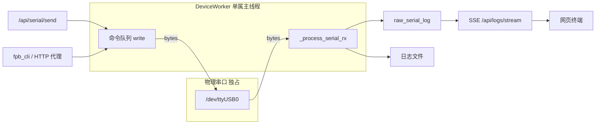
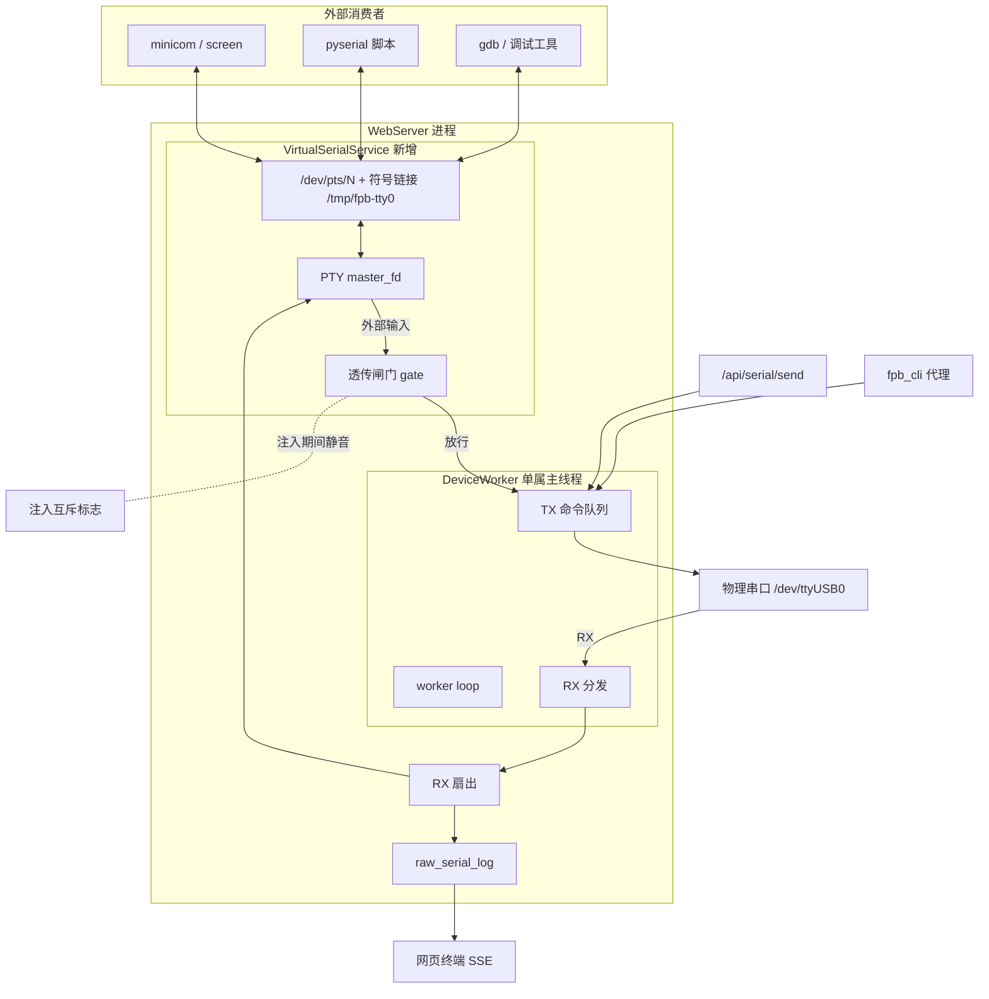
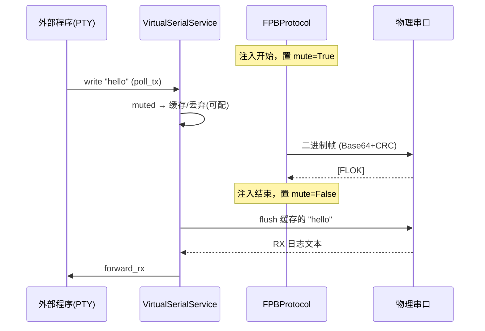
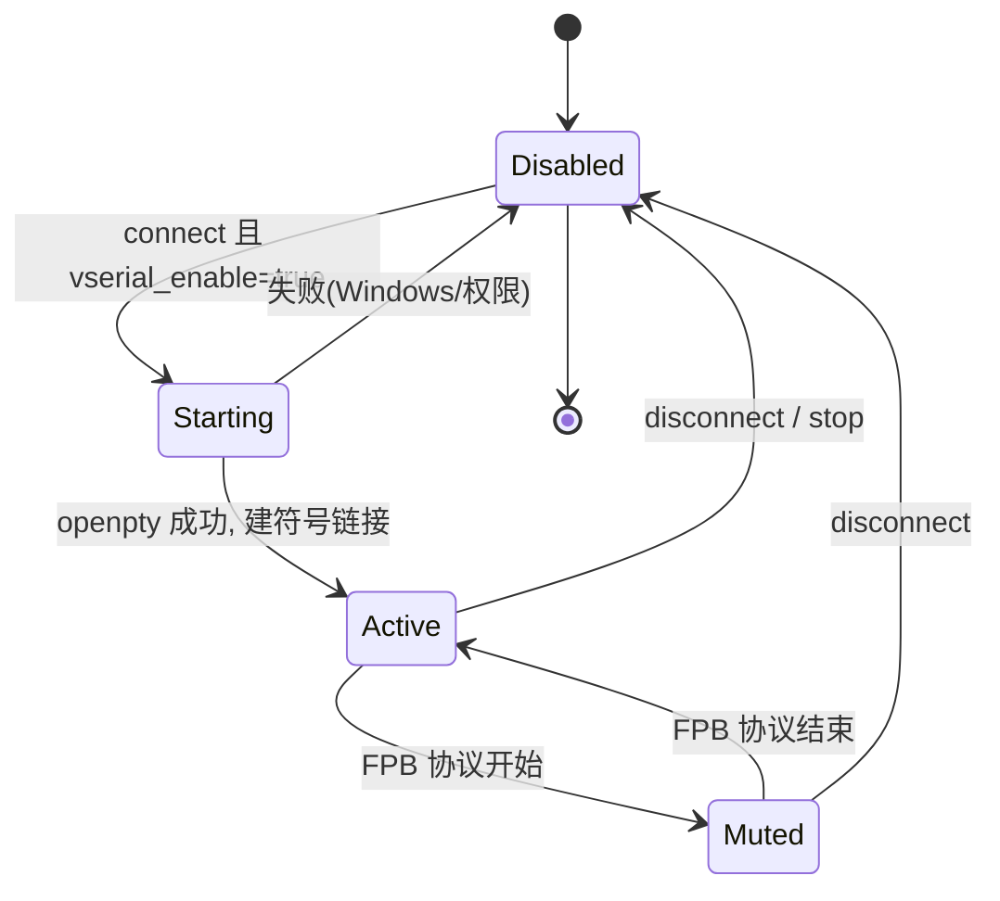
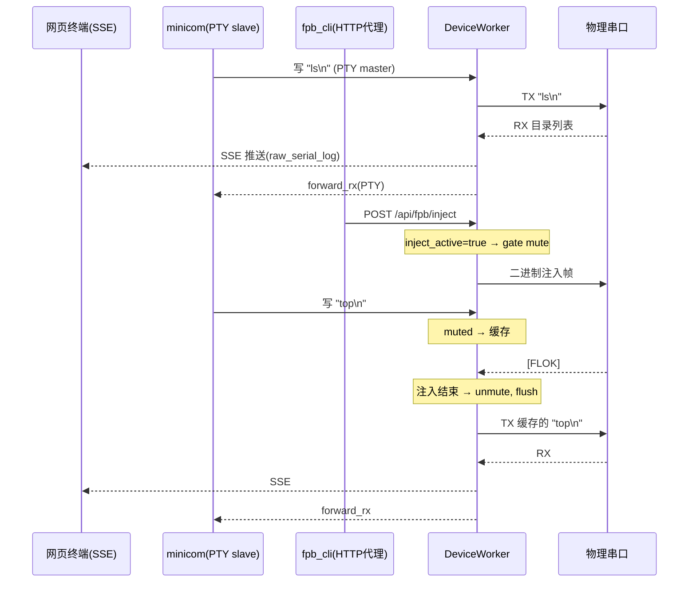
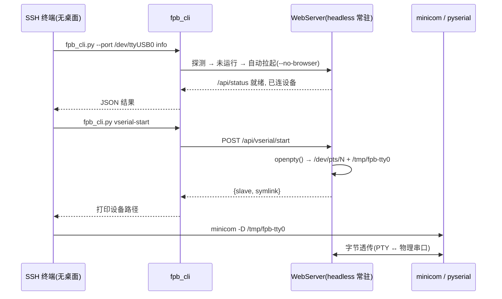

# 虚拟串口透传设计方案

本文档设计一个由 WebServer 托管的**虚拟串口设备文件**（passthrough），使外部程序（`minicom`、`screen`、`pyserial` 脚本、NuttX 调试工具等）可以像访问物理串口一样访问设备，同时保持网页终端与 `fpb_cli` 正常工作。

## 1. 背景与问题

### 1.1 串口是 OS 级独占资源

物理串口（`/dev/ttyUSB0` 等）同一时刻只能被一个进程 `open()`。当前架构下，串口的唯一属主是 WebServer 的 `DeviceWorker` 线程：

- `utils/serial.py::ThreadCheckedSerial` 强制所有 I/O 只能在属主线程调用，非属主线程访问抛 `SerialThreadViolation`。
- `services/device_worker.py::_worker_loop` 是唯一读写串口的地方：TX 走命令队列串行化，RX 在 `_process_serial_rx` 中读取。
- `utils/port_lock.py` 用文件锁防止第二个进程抢占同一物理端口。

因此，只要 WebServer 连着设备，**任何外部程序都无法再打开该物理串口**。用户如果想用自己的串口工具看设备日志或发命令，必须先断开 WebServer——这正是要解决的痛点。

### 1.2 现有的"多入口共存"模型

CLI 和 MCP 已经通过**HTTP 代理**共存（见 `cli-gui-coexistence-plan.md`、`cli/server_proxy.py`）：当 WebServer 运行时，CLI 不直连串口，而是把注入/内存/文件操作委托给 WebServer 的 HTTP API。

但 HTTP 代理只覆盖了**结构化的 FPB 操作**。它无法覆盖：

- 交互式 shell（NuttX nsh、裸机 CLI）的自由文本读写
- 第三方串口工具（`minicom`、`picocom`、`screen`、`pyserial`、GDB over serial 等）
- 需要"真实设备文件"语义的自动化脚本

这些场景需要一个**字节级透传通道**，而不是 RPC 风格的 API。

### 1.3 目标

1. WebServer 连接物理串口后，额外暴露一个虚拟串口设备文件（Linux 上为 PTY slave，如 `/dev/pts/7`，并提供稳定符号链接 `/tmp/fpb-tty0`）。
2. 外部程序打开该虚拟设备，收发的字节被**双向透传**到物理串口。
3. 网页终端、SSE 日志、`fpb_cli` 与虚拟串口**同时工作**，互不独占。
4. 与 FPB 二进制协议（注入/内存/文件传输）**安全仲裁**，避免相互踩踏串口。

## 2. 现状数据流

当前 RX 已经是"一读多分发"，TX 是"多来源单队列"。虚拟串口只需成为新的一路收发端。



关键点：**所有串口访问已经在单线程内串行化**，新增虚拟串口只要挂进同一个 worker 循环，就天然线程安全，无需额外锁。

## 3. 方案选型

| 方案 | 机制 | 跨平台 | 真实设备文件语义 | 复杂度 | 推荐 |
|------|------|--------|------------------|--------|------|
| A. PTY 虚拟串口 | `os.openpty()` 建主从对，slave 即设备文件 | Linux/macOS ✅ / Windows ❌ | ✅ 完整 | 中 | ✅ 主方案 |
| B. TCP 透传 (RFC2217/裸 socket) | 监听 TCP 端口，外部用 `socat`/`rfc2217://` 接入 | 全平台 ✅ | ⚠️ 需客户端支持 | 中 | ✅ 补充方案 |
| C. WebSocket 透传 | 浏览器/JS 客户端字节流 | 全平台 ✅ | ❌ 非设备文件 | 低 | 可选 |
| D. 内核虚拟串口 (tty0tty/com0com) | 依赖外部内核模块 | 需安装驱动 | ✅ | 高 | 不推荐 |

**推荐：A（PTY）为主，B（TCP）为跨平台补充。** 二者可共用同一套"透传端点（PassthroughEndpoint）"抽象，只是底层字节搬运方式不同。本文档以 PTY 为主线，TCP 在 §7 说明。

### 为什么 PTY 最合适

`os.openpty()` 返回 `(master_fd, slave_fd)`。slave 端在 `/dev/pts/N` 生成一个真实的 tty 设备文件，任何串口程序都能像打开真串口一样打开它（`serial.Serial('/dev/pts/N')`、`minicom -D /dev/pts/N`）。WebServer 持有 master_fd，充当"中间人"：

- master 读到的字节 = 外部程序发给设备的数据 → 转发到物理串口 TX 队列
- 物理串口 RX 到的字节 → 写入 master → 外部程序从 slave 读到

## 4. 总体架构



核心思想：**虚拟串口是 RX 扇出的又一个订阅者，TX 的又一个来源**，全部汇入既有的单属主 worker 线程，天然与网页/CLI 共存。

## 5. 详细设计

### 5.1 新增模块 `services/virtual_serial.py`

```python
class VirtualSerialService:
    """PTY-backed virtual serial passthrough, driven by the device worker."""

    def __init__(self, device_state):
        self.device = device_state
        self._master_fd = None
        self._slave_name = None       # /dev/pts/N
        self._symlink_path = None      # /tmp/fpb-tty0（稳定别名）
        self._enabled = False
        self._muted = False            # 注入期间闸门关闭

    def start(self, symlink="/tmp/fpb-tty0") -> tuple[bool, str]:
        """openpty() 建主从对，设为 raw + 非阻塞，建符号链接。"""

    def stop(self):
        """关闭 master_fd，删除符号链接。"""

    # 由 worker 线程调用（单属主，无需锁）
    def forward_rx(self, data: bytes):
        """物理串口 RX → PTY master（非阻塞写，忽略 EAGAIN）。"""

    def poll_tx(self) -> bytes | None:
        """从 PTY master 非阻塞读外部输入；闸门关闭时丢弃或缓存。"""
```

要点：

- `os.openpty()` 后用 `tty.setraw(master)` + `termios` 关闭回显/换行转换，保证纯字节透传。
- master_fd 设 `O_NONBLOCK`，读写都在 worker 循环里做，不新开线程（复用现有单线程模型，避免 `ThreadCheckedSerial` 违规）。
- 符号链接 `/tmp/fpb-tty0` 提供稳定路径，因为 `/dev/pts/N` 的 N 每次不固定。

### 5.2 接入 DeviceWorker 循环

在 `services/device_worker.py::_worker_loop` 中，串口读写已在此线程完成，只需插入两处扇出：

```python
# _process_serial_rx() 内，读到 raw_data 后：
self._add_raw_serial_log(data_str)      # 现有：网页/日志文件
if self.device.vserial and self.device.vserial._enabled:
    self.device.vserial.forward_rx(raw_data)   # 新增：透传给 PTY

# _worker_loop() 内，每轮 tick 增加：
if self.device.vserial and self.device.vserial._enabled:
    ext = self.device.vserial.poll_tx()        # 外部程序 → 设备
    if ext:
        self._serial_write_direct(ext)         # 复用现有 TX 通道
```

因为 RX 分发和 PTY 读写都在同一个 worker 线程，**串口的单属主约束不被破坏**，也不需要新锁。

### 5.3 与 FPB 二进制协议的仲裁（关键）

FPB 注入/内存/文件传输走的是 `core/serial_protocol.py` 的二进制帧协议，运行在 worker 线程回调里，同样独占串口。如果此时外部程序往 PTY 写入字节，会**插进协议帧中间导致 CRC 失败**；反之协议的二进制响应转发给终端只是乱码（无害但可静音）。

> **实现说明**：本方案已落地。闸门的切换**集中在 DeviceWorker 的 `"call"` 命令执行处**——所有 FPB 协议操作（注入/内存/文件传输）都是以 `"call"` 形式排入 worker 队列执行的，因此在执行 `"call"` 前 `mute()`、执行后 `unmute()`，即可一处覆盖全部协议操作，无需在每个 `enter_fl_mode`/inject 入口分别打点。交互式 shell 的自由文本（`"write"` 命令）不触发静音。

仲裁策略——**透传闸门（gate）**：



- 进入 FPB 协议操作前（`FPBProtocol.enter_fl_mode` / 注入 / 传输开始），调用 `vserial.mute()`；结束后 `vserial.unmute()`。
- mute 期间：
  - **外部→设备**：默认缓存到有界队列（上限如 4KB），解除后 flush；可配为直接丢弃。
  - **设备→外部**：默认静音协议帧（避免乱码污染用户终端），可配为透传。
- 复用现有的注入活动标志（`device.inject_active`）与文件传输状态，集中在一处切换 gate，避免散落。

> 设计取舍：FPB 协议本身不频繁（注入/传输是离散动作），日常交互式 shell 流量占绝大多数时间，因此闸门只在少数时刻关闭，用户体验基本无感。

### 5.4 生命周期



集成点：

- **连接时**：`app/routes/connection.py::api_connect` 成功后，若 `device.vserial_enable`，调用 `start_worker` 之后启动 `VirtualSerialService`。
- **断开时**：`api_disconnect` 里在 `stop_worker` 前 `vserial.stop()`，删除 PTY 与符号链接。
- **自启动**：`main.py::restore_state` 的 auto-connect 分支同样按配置拉起虚拟串口。

### 5.5 配置项（`core/config_schema.py`）

新增到 `CONFIG_SCHEMA`（自动进入 `PERSISTENT_KEYS` 并持久化到 `config.json`）：

| key | 类型 | 默认 | 说明 |
|-----|------|------|------|
| `vserial_enable` | BOOLEAN | `false` | 连接后是否创建虚拟串口 |
| `vserial_symlink` | STRING | `/tmp/fpb-tty0` | 稳定符号链接路径（空则不建） |
| `vserial_mute_on_fpb` | BOOLEAN | `true` | FPB 协议期间关闭闸门 |
| `vserial_mute_policy` | SELECT | `buffer` | `buffer`（缓存后补发）/ `drop`（丢弃） |
| `vserial_tcp_enable` | BOOLEAN | `false` | 是否同时开 TCP 透传（见 §7） |
| `vserial_tcp_port` | NUMBER | `0` | TCP 透传端口，0=自动分配 |

### 5.6 API 路由（`app/routes/connection.py` 或新增 `vserial.py`）

| 方法 | 路径 | 作用 |
|------|------|------|
| GET | `/api/vserial/status` | 返回是否启用、slave 路径、符号链接、TCP 端口、mute 状态 |
| POST | `/api/vserial/start` | 运行时启用（无需重连） |
| POST | `/api/vserial/stop` | 运行时停用 |

`/api/status` 响应中附带 `vserial` 字段，供前端在状态栏显示当前虚拟串口路径与连接数，方便用户复制路径。

### 5.7 前端

- 在连接/状态区显示"虚拟串口：`/dev/pts/7` (→ `/tmp/fpb-tty0`)"及一键复制。
- 设置面板由 `config_schema` 自动渲染新增的 `vserial_*` 开关，无需额外前端代码（遵循现有动态渲染约定）。

## 6. 三方共存时序

展示网页终端、外部 minicom、fpb_cli 注入三者同时活动：



三者的公共汇聚点始终是**单属主 worker 线程**，这是共存正确性的根本保证。

## 7. TCP 透传补充方案（跨平台）

Windows 无 PTY。为覆盖全平台，`VirtualSerialService` 可同时监听一个本地 TCP 端口，字节语义与 PTY 完全一致：

- 外部通过 `socat pty,link=/dev/ttyV0 tcp:127.0.0.1:<port>` 造本地设备文件，或用 `rfc2217://` 直连。
- Socket accept/read 放在 worker 循环里用 `select` 非阻塞轮询，或单独 reader 线程仅做 socket→队列（不碰串口，规避 `ThreadCheckedSerial`）。
- 与 PTY 共用同一套 gate/mute 逻辑与 RX 扇出。

> 安全：TCP 透传默认仅绑定 `127.0.0.1`，避免把设备暴露到 LAN。若确需远程，应复用现有 token 鉴权与 `auto_ban` 机制，并在文档明确风险。

## 8. 与 CLI/MCP 的关系

- `fpb_cli` 的 HTTP 代理路径**完全不变**：结构化操作仍走 API。
- 虚拟串口是**给外部字节流工具**用的正交通道，不替代代理。
- 端口锁（`port_lock.py`）逻辑不变：物理端口仍由 WebServer 独占，虚拟串口不参与物理端口竞争。

### 8.1 fpb_cli 配置虚拟串口（已实现）

`fpb_cli` 新增 `vserial` 子命令，**只在代理模式下工作**——命令被转发到 WebServer 的 `/api/vserial/*`：

子命令采用扁平连字符风格，与 CLI 现有的 `file-list`/`file-stat`/`server-stop` 等保持一致：

```bash
fpb_cli.py vserial-start                       # 让服务器创建 PTY
fpb_cli.py vserial-start --symlink /tmp/tty0 --mute-policy drop
fpb_cli.py vserial-status                      # 查询 slave 路径 / 静音状态
fpb_cli.py vserial-stop                        # 移除 PTY
```

对应实现：
- `cli/server_proxy.py`：`vserial_status()` / `vserial_start()` / `vserial_stop()` 三个 HTTP 包装。
- `cli/fpb_cli.py`：`FPBCLI.vserial_start/stop/status` 三个方法 + `vserial-start`/`vserial-stop`/`vserial-status` 三个子命令。

### 8.2 为什么必须由服务器托管，而不是 CLI 自己开 PTY（关键）

**PTY 的生命周期绑定创建它的进程**。`fpb_cli` 是一次性进程（connect → 执行 → 退出），若由 CLI 自己 `openpty()`，进程一退 `/dev/pts/N` 立即消失，外部工具根本来不及打开。因此虚拟串口只能挂在**常驻的 WebServer** 上。

CLI 在直连（`--direct`）模式下没有常驻进程，`vserial` 会直接报错并提示先启动服务器。这是设计约束，不是缺陷。

### 8.3 无桌面（headless）环境适配

虚拟串口对无头环境是**天然契合**的，因为 PTY 是纯内核 tty 机制，**不依赖任何图形界面**：

- WebServer 的自动拉起用的就是 `--no-browser`（`server_proxy.launch_server`），无头友好；`main.py` 也支持 `--no-mdns` 等纯后台参数。
- 典型用法：SSH 进无桌面主机/板子 → `fpb_cli.py --port /dev/ttyUSB0 info`（首次带 `--port` 会自动拉起 headless 服务器并连接）→ `fpb_cli.py vserial-start` → 本地 `minicom -D /tmp/fpb-tty0`。
- 全程只有终端，无需浏览器、无需 X11/Wayland。



> Windows 无 PTY，headless 场景应改用 §7 的 TCP 透传（`socat`/`rfc2217://`）。

## 9. 实施计划

| 阶段 | 内容 | 改动范围 | 风险 |
|------|------|----------|------|
| P1 | `VirtualSerialService`（PTY 创建/收发/符号链接） | 新增 `services/virtual_serial.py` | 低 |
| P2 | 接入 worker RX 扇出 + TX 轮询 | 改 `services/device_worker.py` | 中 |
| P3 | gate/mute 仲裁，接 `inject_active`/传输状态 | 改 `serial_protocol.py`、`file_transfer.py` 调用点 | 中 |
| P4 | 配置项 + 连接/断开/自启动生命周期 | 改 `config_schema.py`、`connection.py`、`main.py` | 低 |
| P5 | API 路由 + 前端状态显示 | 新增 `app/routes/vserial.py`、前端状态栏 | 低 |
| P6 | TCP 透传（跨平台） | 扩展 `virtual_serial.py` | 中 |

建议 P1→P2→P4 先打通"能创建、能透传、能随连接生命周期启停"的最小闭环，再做 P3 仲裁与 P5/P6 增强。

## 10. 测试要点

遵循 `webserver-dev.md`：`tests/` 下新增 `test_virtual_serial.py`，mock `os.openpty`/`os.read`/`os.write`。

- PTY 建立后 `forward_rx` 把 RX 字节写入 master，slave 端可读到。
- `poll_tx` 从 master 读到外部输入并进入 TX 队列。
- mute 期间 `buffer` 策略缓存、`drop` 策略丢弃；unmute 后 buffer 补发。
- FPB 注入进行时外部写入不污染协议帧（用 mock 协议交换验证 gate 生效）。
- 断开时符号链接被清理、master_fd 关闭。
- 三方并发（网页 SSE + PTY + 代理注入）冒烟测试。

## 11. 已知限制

- **Windows 无原生 PTY**：需用 TCP 透传 + `socat`/`com0com`，或第三方虚拟串口驱动。
- PTY slave 路径 `/dev/pts/N` 不固定，依赖符号链接提供稳定别名；符号链接需要 `/tmp` 可写。
- 单消费者假设：PTY 主从是点对点，多个外部程序同时打开同一 slave 行为未定义；如需多客户端应走 TCP 多连接扇出。
- mute 期间的交互延迟：注入/大文件传输时，外部终端输入会被短暂缓存，属预期行为。
