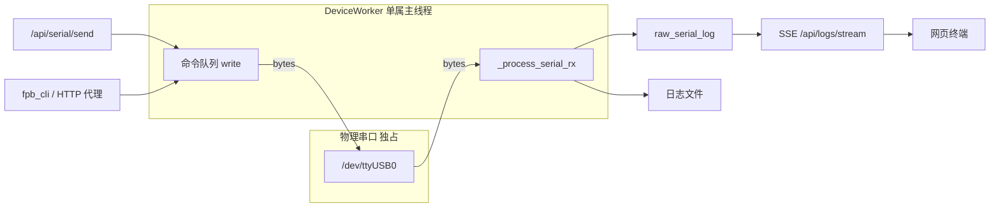
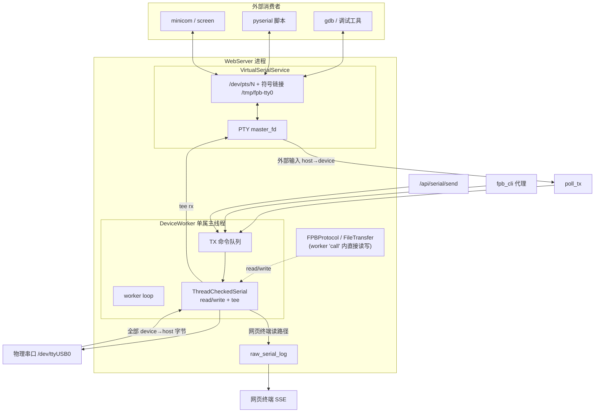
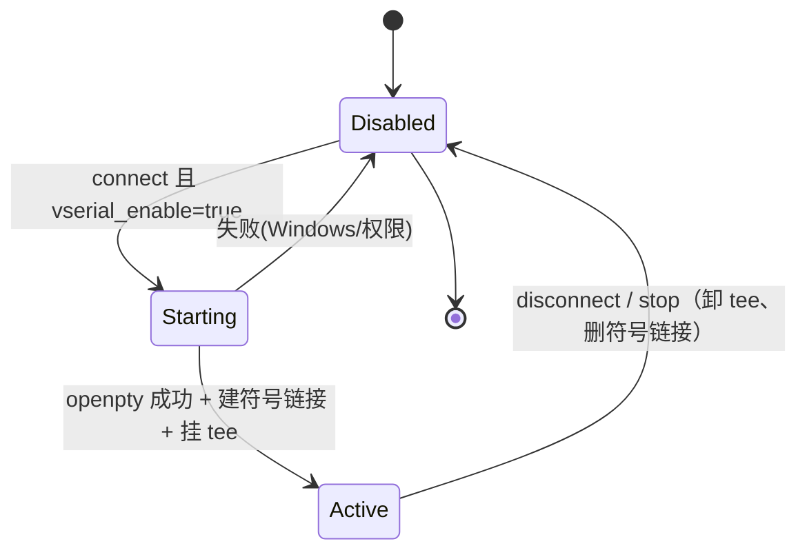
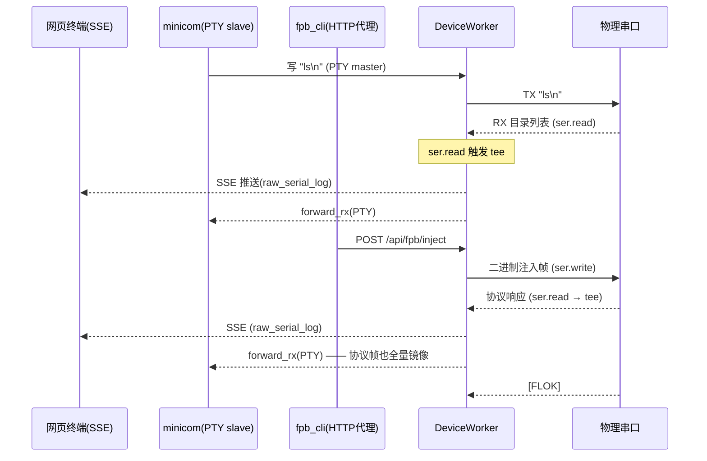
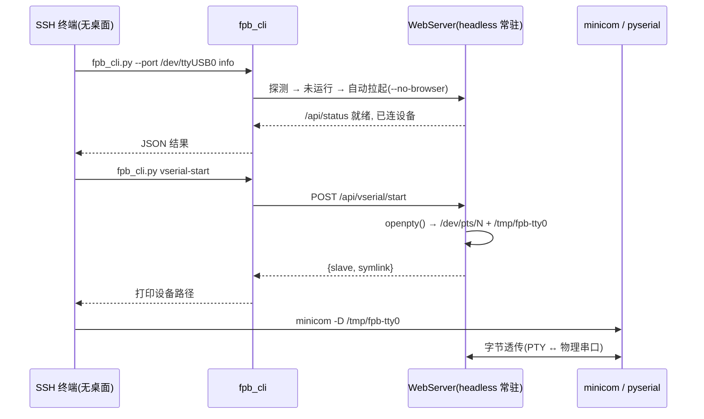

# 虚拟串口透传设计方案

本文档设计一个由 WebServer 托管的**虚拟串口设备文件**（passthrough），使外部程序（`minicom`、`screen`、`pyserial` 脚本、NuttX 调试工具等）可以像访问物理串口一样访问设备，同时保持网页终端与 `fpb_cli` 正常工作。

## 1. 背景与问题

### 1.1 串口是 OS 级独占资源

物理串口（`/dev/ttyUSB0` 等）同一时刻只能被一个进程 `open()`。当前架构下，串口的唯一属主是 WebServer 的 `DeviceWorker` 线程：

- `utils/serial.py::ThreadCheckedSerial` 强制所有 I/O 只能在属主线程调用，非属主线程访问抛 `SerialThreadViolation`。
- `services/device_worker.py::_worker_loop` 是唯一读写串口的地方：TX 走命令队列串行化，RX 在 `_process_serial_rx` 中读取。
- `utils/port_lock.py` 用文件锁防止第二个进程抢占同一物理端口。

因此，只要 WebServer 连着设备，**任何外部程序都无法再打开该物理串口**。用户如果想用自己的串口工具看设备日志或发命令，必须先断开 WebServer——这正是要解决的痛点。

### 1.2 现有的"多入口共存"模型

CLI 和 MCP 已经通过**HTTP 代理**共存（见 `cli-gui-coexistence-plan.md`、`cli/server_proxy.py`）：当 WebServer 运行时，CLI 不直连串口，而是把注入/内存/文件操作委托给 WebServer 的 HTTP API。

但 HTTP 代理只覆盖了**结构化的 FPB 操作**。它无法覆盖：

- 交互式 shell（NuttX nsh、裸机 CLI）的自由文本读写
- 第三方串口工具（`minicom`、`picocom`、`screen`、`pyserial`、GDB over serial 等）
- 需要"真实设备文件"语义的自动化脚本

这些场景需要一个**字节级透传通道**，而不是 RPC 风格的 API。

### 1.3 目标

1. WebServer 连接物理串口后，额外暴露一个虚拟串口设备文件（Linux 上为 PTY slave，如 `/dev/pts/7`，并提供稳定符号链接 `/tmp/fpb-tty0`）。
2. 外部程序打开该虚拟设备，收发的字节被**双向透传**到物理串口。
3. 网页终端、SSE 日志、`fpb_cli` 与虚拟串口**同时工作**，互不独占。
4. 与 FPB 二进制协议（注入/内存/文件传输）**安全仲裁**，避免相互踩踏串口。

## 2. 现状数据流

当前 RX 已经是"一读多分发"，TX 是"多来源单队列"。虚拟串口只需成为新的一路收发端。



关键点：**所有串口访问已经在单线程内串行化**，新增虚拟串口只要挂进同一个 worker 循环，就天然线程安全，无需额外锁。

## 3. 方案选型

| 方案 | 机制 | 跨平台 | 真实设备文件语义 | 复杂度 | 推荐 |
|------|------|--------|------------------|--------|------|
| A. PTY 虚拟串口 | `os.openpty()` 建主从对，slave 即设备文件 | Linux/macOS ✅ / Windows ❌ | ✅ 完整 | 中 | ✅ 主方案 |
| B. TCP 透传 (RFC2217/裸 socket) | 监听 TCP 端口，外部用 `socat`/`rfc2217://` 接入 | 全平台 ✅ | ⚠️ 需客户端支持 | 中 | ✅ 补充方案 |
| C. WebSocket 透传 | 浏览器/JS 客户端字节流 | 全平台 ✅ | ❌ 非设备文件 | 低 | 可选 |
| D. 内核虚拟串口 (tty0tty/com0com) | 依赖外部内核模块 | 需安装驱动 | ✅ | 高 | 不推荐 |

**推荐：A（PTY）为主，B（TCP）为跨平台补充。** 二者可共用同一套"透传端点（PassthroughEndpoint）"抽象，只是底层字节搬运方式不同。本文档以 PTY 为主线，TCP 在 §7 说明。

### 为什么 PTY 最合适

`os.openpty()` 返回 `(master_fd, slave_fd)`。slave 端在 `/dev/pts/N` 生成一个真实的 tty 设备文件，任何串口程序都能像打开真串口一样打开它（`serial.Serial('/dev/pts/N')`、`minicom -D /dev/pts/N`）。WebServer 持有 master_fd，充当"中间人"：

- master 读到的字节 = 外部程序发给设备的数据 → 转发到物理串口 TX 队列
- 物理串口 RX 到的字节 → 写入 master → 外部程序从 slave 读到

## 4. 总体架构



核心思想：**在 `ThreadCheckedSerial` 的 `read()` 出口挂一个 tee**，把所有 device→host 字节（含 FPB 协议帧）镜像给 PTY。这样无论协议层在 worker `"call"` 里怎么直接读写串口，虚拟串口都能拿到**全量**数据流。外部输入则由 `poll_tx` 在 worker 循环里读出、汇入既有 TX 通道。全部 I/O 都在单属主 worker 线程内串行执行，天然与网页/CLI 共存，无需额外锁。

## 5. 详细设计

### 5.1 新增模块 `services/virtual_serial.py`

```python
class VirtualSerialService:
    """PTY-backed virtual serial passthrough, driven by the device worker."""

    def __init__(self, device_state):
        self.device = device_state
        self._master_fd = None
        self._slave_name = None       # /dev/pts/N
        self._symlink_path = None      # /tmp/fpb-tty0（稳定别名）
        self._enabled = False

    def start(self, symlink="/tmp/fpb-tty0") -> tuple[bool, str]:
        """openpty() 建主从对，设为 raw + 非阻塞，建符号链接；
        并在 device.ser（ThreadCheckedSerial）上挂 rx tee = forward_rx。"""

    def stop(self):
        """卸载 tee，关闭 master_fd，删除符号链接。"""

    # 由 worker 线程调用（单属主，无需锁）
    def forward_rx(self, data: bytes):
        """device→host 字节 → PTY master（非阻塞写，背压时丢弃，绝不阻塞 worker）。
        既被 worker RX 路径调用，也被 ThreadCheckedSerial 的 tee 在协议读时调用。"""

    def poll_tx(self) -> bytes | None:
        """从 PTY master 非阻塞读外部输入（host→device），交给 TX 通道。"""
```

要点：

- `os.openpty()` 后用 `tty.setraw(master/slave)` 关闭回显/换行转换，保证纯字节透传。
- master_fd 设 `O_NONBLOCK`，读写都在 worker 循环里做，不新开线程（复用现有单线程模型，避免 `ThreadCheckedSerial` 违规）。
- 符号链接 `/tmp/fpb-tty0` 提供稳定路径，因为 `/dev/pts/N` 的 N 每次不固定。
- **全量透传的关键**：`start()` 时把 `forward_rx` 注册为 `ThreadCheckedSerial` 的 rx tee。协议层（`FPBProtocol`/`FileTransfer`）在 worker `"call"` 里调用的 `ser.read()` 会同步触发 tee，因此**连注入/文件传输的二进制帧也会完整镜像到 PTY**——不再有"传输时虚拟串口空白"的问题。

### 5.2 接入 ThreadCheckedSerial（tee）与 DeviceWorker 循环

**device→host（全量透传）** 的关键改动在 `utils/serial.py::ThreadCheckedSerial`：`read()`/`write()` 显式实现，`read()` 返回时把字节同步喂给已注册的 rx tee。

```python
# utils/serial.py
class ThreadCheckedSerial:
    def set_tee(self, tx=None, rx=None):
        self._tee_tx, self._tee_rx = tx, rx

    def read(self, *a, **k):
        self._check_thread("read")
        data = self._ser.read(*a, **k)
        if data and self._tee_rx:
            try: self._tee_rx(data)     # → vserial.forward_rx
            except Exception: pass
        return data
```

`VirtualSerialService.start()` 里 `device.ser.set_tee(rx=self.forward_rx)`，`stop()` 里 `set_tee(rx=None)`。

**host→device** 仍在 worker 循环里轮询 PTY：

```python
# _worker_loop() 每轮 tick：
data = self.device.vserial.poll_tx()   # 外部程序输入
if data:
    self._serial_write_direct(data)    # 复用现有 TX 通道
```

因为 tee 回调在 `ser.read()` 的调用栈内同步执行、PTY 读写也在 worker 循环里，**全部串口 I/O 仍在单属主 worker 线程**，单属主约束不被破坏，无需新锁。worker 的 `_process_serial_rx()` 也会经 `ser.read()` 触发 tee，因此**无需**再单独调用 `forward_rx`（避免重复写入）。

### 5.3 全量透传，不做静音（设计演进）

> **早期方案（已废弃）**：曾在 FPB 协议操作期间"静音（mute）"透传，担心外部输入插进二进制帧导致 CRC 失败。但该方案把 device→host 方向也一并静音，导致**文件传输/注入时虚拟串口一片空白**——违背了"像 fpb_cli 一样完全透传"的目标。故移除 mute，改为 tee 全量透传。

现方案下：

- **device→host**：经 tee **无条件全量镜像**，包括 FPB 二进制帧。外部工具（minicom 等）看到与网页终端完全一致的数据流。
- **host→device**：外部输入原样写入物理串口（`poll_tx` → TX 通道），语义即"你敲什么就发什么"。
- **协议帧污染的处理**：若用户在传输进行中恰好从外部敲入字节，可能触发该次传输的一次 CRC 重试——由现有 `transfer_max_retries` 机制自愈。这是完全透传应有的语义，属可接受的极端边缘情况，不再为它牺牲透传能力。

**线程安全**：与 mute 无关。所有串口 I/O（tee 回调、PTY 读写、协议读写）都在单一 worker 线程内同步串行，`ThreadCheckedSerial` 还会强制校验属主线程。`forward_rx` 的 `os.write` 为非阻塞，PTY 缓冲满时丢弃片段（`BlockingIOError`），绝不阻塞 worker。

### 5.4 生命周期



集成点：

- **连接时**：`app/routes/connection.py::api_connect` 成功后，若 `device.vserial_enable`，调用 `start_worker` 之后启动 `VirtualSerialService`。
- **断开时**：`api_disconnect` 里在 `stop_worker` 前 `vserial.stop()`，删除 PTY 与符号链接。
- **自启动**：`main.py::restore_state` 的 auto-connect 分支同样按配置拉起虚拟串口。

### 5.5 配置项（`core/config_schema.py`）

新增到 `CONFIG_SCHEMA`（自动进入 `PERSISTENT_KEYS` 并持久化到 `config.json`）：

| key | 类型 | 默认 | 说明 |
|-----|------|------|------|
| `vserial_enable` | BOOLEAN | `false` | 连接后是否创建虚拟串口 |
| `vserial_symlink` | STRING | `/tmp/fpb-tty0` | 稳定符号链接路径（空则不建） |
| `vserial_tcp_enable` | BOOLEAN | `false` | 是否同时开 TCP 透传（见 §7，规划中） |
| `vserial_tcp_port` | NUMBER | `0` | TCP 透传端口，0=自动分配（规划中） |

> 注：早期设计的 `vserial_mute_on_fpb` / `vserial_mute_policy` 已随 mute 机制移除。当前落地的持久化项为 `vserial_enable`、`vserial_symlink`。

### 5.6 API 路由（`app/routes/connection.py` 或新增 `vserial.py`）

| 方法 | 路径 | 作用 |
|------|------|------|
| GET | `/api/vserial/status` | 返回是否启用、slave 路径、符号链接 |
| POST | `/api/vserial/start` | 运行时启用（无需重连） |
| POST | `/api/vserial/stop` | 运行时停用 |

`/api/status` 响应中附带 `vserial` 字段，供前端在状态栏显示当前虚拟串口路径，方便用户复制路径。

### 5.7 前端

- 在连接/状态区显示"虚拟串口：`/dev/pts/7` (→ `/tmp/fpb-tty0`)"及一键复制。
- 设置面板由 `config_schema` 自动渲染新增的 `vserial_*` 开关，无需额外前端代码（遵循现有动态渲染约定）。

## 6. 三方共存时序

展示网页终端、外部 minicom、fpb_cli 注入三者同时活动：



三者的公共汇聚点始终是**单属主 worker 线程**，这是共存正确性的根本保证。注入/文件传输期间，协议帧经 tee **同样全量镜像**到 minicom，不再静音。

## 7. TCP 透传补充方案（跨平台）

Windows 无 PTY。为覆盖全平台，`VirtualSerialService` 可同时监听一个本地 TCP 端口，字节语义与 PTY 完全一致：

- 外部通过 `socat pty,link=/dev/ttyV0 tcp:127.0.0.1:<port>` 造本地设备文件，或用 `rfc2217://` 直连。
- Socket accept/read 放在 worker 循环里用 `select` 非阻塞轮询，或单独 reader 线程仅做 socket→队列（不碰串口，规避 `ThreadCheckedSerial`）。
- 与 PTY 共用同一套 tee 全量透传逻辑（device→host 经 tee 镜像，host→device 汇入 TX）。

> 安全：TCP 透传默认仅绑定 `127.0.0.1`，避免把设备暴露到 LAN。若确需远程，应复用现有 token 鉴权与 `auto_ban` 机制，并在文档明确风险。

## 8. 与 CLI/MCP 的关系

- `fpb_cli` 的 HTTP 代理路径**完全不变**：结构化操作仍走 API。
- 虚拟串口是**给外部字节流工具**用的正交通道，不替代代理。
- 端口锁（`port_lock.py`）逻辑不变：物理端口仍由 WebServer 独占，虚拟串口不参与物理端口竞争。

### 8.1 fpb_cli 配置虚拟串口（已实现）

`fpb_cli` 新增 `vserial` 子命令，**只在代理模式下工作**——命令被转发到 WebServer 的 `/api/vserial/*`：

子命令采用扁平连字符风格，与 CLI 现有的 `file-list`/`file-stat`/`server-stop` 等保持一致：

```bash
fpb_cli.py vserial-start                       # 让服务器创建 PTY
fpb_cli.py vserial-start --symlink /tmp/tty0   # 自定义符号链接
fpb_cli.py vserial-status                      # 查询 slave 路径
fpb_cli.py vserial-stop                        # 移除 PTY
```

对应实现：
- `cli/server_proxy.py`：`vserial_status()` / `vserial_start()` / `vserial_stop()` 三个 HTTP 包装。
- `cli/fpb_cli.py`：`FPBCLI.vserial_start/stop/status` 三个方法 + `vserial-start`/`vserial-stop`/`vserial-status` 三个子命令。

### 8.2 为什么必须由服务器托管，而不是 CLI 自己开 PTY（关键）

**PTY 的生命周期绑定创建它的进程**。`fpb_cli` 是一次性进程（connect → 执行 → 退出），若由 CLI 自己 `openpty()`，进程一退 `/dev/pts/N` 立即消失，外部工具根本来不及打开。因此虚拟串口只能挂在**常驻的 WebServer** 上。

CLI 在直连（`--direct`）模式下没有常驻进程，`vserial` 会直接报错并提示先启动服务器。这是设计约束，不是缺陷。

### 8.3 无桌面（headless）环境适配

虚拟串口对无头环境是**天然契合**的，因为 PTY 是纯内核 tty 机制，**不依赖任何图形界面**：

- WebServer 的自动拉起用的就是 `--no-browser`（`server_proxy.launch_server`），无头友好；`main.py` 也支持 `--no-mdns` 等纯后台参数。
- 典型用法：SSH 进无桌面主机/板子 → `fpb_cli.py --port /dev/ttyUSB0 info`（首次带 `--port` 会自动拉起 headless 服务器并连接）→ `fpb_cli.py vserial-start` → 本地 `minicom -D /tmp/fpb-tty0`。
- 全程只有终端，无需浏览器、无需 X11/Wayland。



> Windows 无 PTY，headless 场景应改用 §7 的 TCP 透传（`socat`/`rfc2217://`）。

## 9. 实施计划

| 阶段 | 内容 | 改动范围 | 风险 |
|------|------|----------|------|
| P1 | `VirtualSerialService`（PTY 创建/收发/符号链接） | 新增 `services/virtual_serial.py` | 低 |
| P2 | tee 全量透传（`ThreadCheckedSerial.set_tee`）+ worker TX 轮询 | 改 `utils/serial.py`、`services/device_worker.py` | 中 |
| P4 | 配置项 + 连接/断开/自启动生命周期 | 改 `config_schema.py`、`connection.py`、`main.py` | 低 |
| P5 | API 路由 + 前端状态显示 | `app/routes/connection.py`、前端状态栏 | 低 |
| P6 | TCP 透传（跨平台） | 扩展 `virtual_serial.py` | 中 |

P1/P2/P4/P5 已落地并在真实设备上验证全量透传。P6（TCP 跨平台）待做。原计划中的"P3 gate/mute 仲裁"已废弃——改用 tee 全量透传，不再静音。

## 10. 测试要点

遵循 `webserver-dev.md`：`tests/` 下新增 `test_virtual_serial.py`，mock `os.openpty`/`os.read`/`os.write`。

- PTY 建立后 `forward_rx` 把字节写入 master，slave 端可读到。
- `poll_tx` 从 master 读到外部输入并进入 TX 队列。
- `start()` 在 `ThreadCheckedSerial` 上挂 rx tee = `forward_rx`；`stop()` 卸载。
- 经 tee 喂入的字节（模拟协议层 `ser.read()`）能镜像到 slave —— 验证注入/传输期间的全量透传。
- 断开时符号链接被清理、master_fd 关闭、tee 卸载。
- 三方并发（网页 SSE + PTY + 代理注入）冒烟测试（真实设备已验证）。

## 11. 已知限制

- **Windows 无原生 PTY**：需用 TCP 透传 + `socat`/`com0com`，或第三方虚拟串口驱动。
- PTY slave 路径 `/dev/pts/N` 不固定，依赖符号链接提供稳定别名；符号链接需要 `/tmp` 可写。
- 单消费者假设：PTY 主从是点对点，多个外部程序同时打开同一 slave 行为未定义；如需多客户端应走 TCP 多连接扇出。
- 全量透传语义：若在文件传输/注入进行中从外部敲入字节，可能触发该次传输的一次 CRC 重试（由 `transfer_max_retries` 自愈）。这是"完全透传"的预期行为，不再静音。
